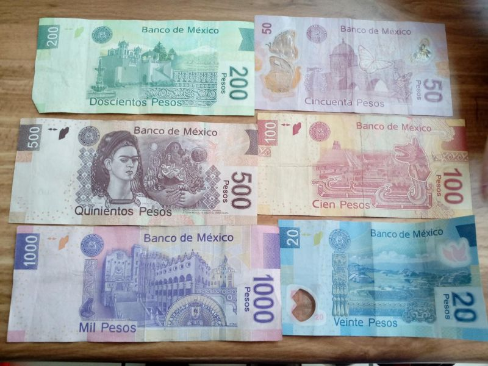

## Annual Bonus (Aguinaldo) in Mexico

It’s that time of year again: workers in Mexico are entitled to their annual bonus, known as the **aguinaldo**. This is **not optional**—it is mandated by law.  

### What the Law Says

Under **Article 87 of the Federal Labor Law**, all employees must receive an annual bonus equivalent to at least **15 days of salary**, paid no later than **December 20th**. Even employees who have not completed a full year of service are entitled to a proportional payment based on the time they have worked.  

Recent legislative initiatives have proposed **increasing the minimum aguinaldo from 15 to 30 days of salary**, though as of late 2025 this reform is still under discussion. Employers should stay alert to updates, as this change could double the minimum obligation.  

### How to Calculate

1. **Weekly salary ÷ 6 = daily rate**  
2. **Daily rate × 15 = minimum aguinaldo**  

Example:  
- A gardener earning **$500 pesos per day, one day per week** → minimum bonus = **$1,000 pesos**.  
- A worker earning **$5,000 pesos per month** → minimum bonus = **$2,500 pesos**.  

Many employers choose to pay **two weeks’ salary** as a straightforward calculation, but the law requires at least 15 days.  

### Practical Guidance

- **Deadline:** Pay by **December 20th** each year.  
- **Scope:** Applies to all employees, including domestic staff such as gardeners, cleaners, and drivers.  
- **Documentation:** Keep written records of payments to avoid disputes.  
- **Penalties:** Late or missing payments can result in fines and legal complications.  

---

## ✨ Did You Know? Aguinaldo Insights

- 🎄 The aguinaldo is separate from vacation pay and is intended to help families with holiday expenses.  
- 🏠 Domestic workers are explicitly included—if you employ household staff, you must pay them too.  
- 📈 Proposed reforms could double the minimum bonus to **30 days of salary**, reflecting efforts to improve worker benefits.  
- 💵 Payment must be in pesos, not foreign currency.  
- 📅 Many employers pay more than the minimum to maintain goodwill and avoid disputes.  

---

## Reflection

Paying the aguinaldo is more than a legal requirement—it’s a cultural tradition that supports workers during the holiday season. For employers, it’s an opportunity to show respect and appreciation. Whether you pay the minimum 15 days or choose to give more, **make sure it’s done on time**. Staying informed about upcoming reforms will help you avoid surprises and maintain good relationships with your employees.
