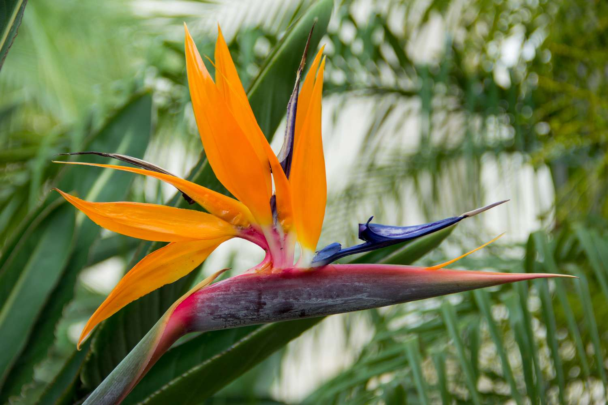

## 🌺 Paradise in Bloom
I really love living in Mexico. It feels like paradise near Mexico City, where "snow" is a foreign word and the only ice you find is in your drink. My favorite flower, the **bird of paradise**, grows everywhere here — I even have some in my garden.

---

## 🦂 A Scorpion Surprise
But paradise has its dangers. One night, I woke to a tingling sensation on my nose. Half-asleep, I reached up to scratch it — only to discover something that terrifies most people: **a scorpion**.

It stung me right on the bridge of my nose. I immediately took Benadryl and applied lidocaine to numb the pain. For the next two weeks, the area around my nose and eyes remained numb.

---

## 🧾 Sidebar: Scorpions in Mexico
- Mexico is home to over **200 species of scorpions**.  
- The most dangerous belong to the *Centruroides* genus, found in central and northern regions.  
- While fatalities are rare today thanks to antivenom, stings can still cause intense pain, numbness, and swelling.  
- Locals often keep chickens or cats around — both are natural scorpion hunters.  

---

## 🔎 Reflection
Living in Mexico is a balance of beauty and risk. The flowers remind me daily why I love it here, but the wildlife reminds me that paradise isn’t always gentle.  

This experience taught me two things:  
1. **Respect the environment** — paradise comes with its own rules.  
2. **Adaptation is survival** — whether it’s learning to check your sheets before bed or keeping antivenom handy, expat life means adjusting to realities that locals already know.

---

## 📜 Epilogue
Years later, I laugh about the incident, but it remains one of those “expat stories” that defines life abroad. Paradise isn’t perfect — but its imperfections are what make the experience real, memorable, and worth sharing.
