## Getting Started

**How to create a MacOS 15 Sequoia VM in VMware**

Over the years, I have noticed that a lot of people seem to have bought into the marketing of Apple and believe that the Mac is the best computer. Apple has won the marketing game just like Bose has done with speakers. Audiophiles say that if you want no highs or lows, you buy Bose!  Most people just don't seem to get that while Apple does provide a good product, they are overpriced for what they provide and it isn't close to the value most Windows-based computers are. Yes, you can find value with Linux but most people are more comfortable with what they already have been using for years -- Windows.

So, what can you do besides paying the ransom to get a Mac system? Well,there are things that you can do. You can be a glutton for punishment and buy a Mac. I am sorry if you feel like this is the answer. Unfortunately, you need to either be a child of a Oligarch, be a trust fund baby, dealing crystal meth, burglarizing other people's homes, or just be an idiot to go out and buy a Mac system in my opinion. Why? There are things that can be done to help you try the Mac environment without going to the expense of buying a Mac.

I am one of those "old school" techs from years ago that looks at Operating Systems as if they were airlines. With Mac Airlines, all the stewards, stewardesses, captains, first officers, baggage handlers and customer service agents look like clones of one another. They all talk the same way and act like each other. Every time you ask questions about the details, you are told you don't need to know, don't want to know, and that you need to get your butt back into your seat and enjoy watching the 99th playing of the Barney movie.

Some may try to label me as an Apple-hater.  That isn't the truth at all.  I got my first Apple certification in 1994 and have been certified with them ever since.  When did you get your first certification with Apple?  The truth is that I hate Apple's business practices and won't personally buy any of their equipment again. I believe in the "right to repair" and feel that any company that keeps you from repairing your own equipment is evil incarinate.  

Don't worry about me. I am the type of person that ate paint chips as a child and will change the thermometer from Fahrenheit to Celsius when it gets too hot and the lower number convinces me it is cooler. Don't worry, I am not going to act like Roy and Moss about computers in real life. (If you are in IT and don't know that reference, you are really missing out and need to go watch "The IT Crowd" and soon!
https://www.youtube.com/@TheITCrowdChannel/videos)

Having said all of this, I am going to teach you how to build a Mac Sequoia VM on your Windows system. Here is how you do it!

Before we start building this VM, you need to verify that you have the minimum available system resources to run a Sequoia VM. You need the following:

- Processor: Intel Core i-series, AMD Ryzen (8 cores or more
  recommended)

- RAM: 8 GB (16 GB recommended) Graphics card: iGPU or dedicated
  graphics card Sound card:

- ASIO-compatible sound card (native ASIO driver recommended)

- Available drive space: 2 GB for minimum installation, 90 GB with
  instruments and sounds

- Internet connection: Recommended for license activation, offline
  license activation possible

If you do not have these minimum requirements met by your PC, you will not be able to do this build and need to accept this fact.

Getting ready to create the VM.

There are a few steps that you must take before you are ready to build this VM. Here they are:

1.  Download the Mac OSX Sequoia iso from Internet Archive.
    <https://archive.org/details/install-mac-os-sequoia> If this link
    isn't active, go to the Internet Archive website and search for "mac
    os sequoia iso" and find it. It isn't that hard to do.
  

2.  Download VMware Workstation player here: [VMware
    Player](https://archive.org/download/vmware-player-full-17.5.0-22583795_202402/VMware-player-full-17.5.0-22583795.exe)
    Hopefully this link sticks around. If it doesn't work, let me know and I will try to put up a new one OR you can do something for yourself and Google it!

3.  Download MacOS Unlocker for VMware Workstation.
    <https://github.com/DrDonk/unlocker/releases/>

4.  Install VMware Workstation Player, accepting the defaults as they
    come up

5.  Go to where you downloaded Unlocker. Extract Unlocker into a
    separate folder.

6.  Go into the Unlocker folder, go into the Windows folder, right click
    on Unlock.exe, and select "run as administrator".

7.  Click "yes" and let it do its thing.

8.  Wait for the patching to finish. It is like watching paint dry. It can take a bit of time but hopefully not too long.
   

9.  Hit the "Enter" key when the white text on the black window says to do it. It will finish this program and you can close the window.

Creating the Sequoia VM

1.  Launch VMware Workstation Player

2.  Select continue to use Workstation player for non-commercial use.

3.  Click finish.

4.  Click "Create a New Virtual Machine".

5.  It will bring up the "Welcome to the New Virtual Machine Wizard screen. Leave the dot on "Typical", and click next.
    

6.  Select "Installer disc image file (iso), click browse, and go find your Sequoia ISO that you downloaded.
    

7.  Click "Next".

8.  Select Apple Mac OS X and Mac OS15.
   [image 7](image7.png)

9.  Click Next.

10. Name your VM and set the path to where you want to store the VM.
   

11. Change the disk size to 100GB and set the option to store the file as a single file. Click "Next".
   

12. Click "Customize hardware" button.

13. Increase RAM to 8GB or greater. Increase the CPU to 4 cores. The minimum amount of RAM to run Seqouia is 8GB but 16GB is recommended.  I hope you have the resources needed to run your core operating system AND the VM.
 
    

14. Configure Network adapter to "Bridged".
    

15. Click "Close" and then "Finish" to complete the configuration.
   

16. In the left tab of VMWare, you will see the VM you are creating. Right click on the name, and select "open VM directory".
   

17. Right click on the .vmx file and open it in your favorite text editor.

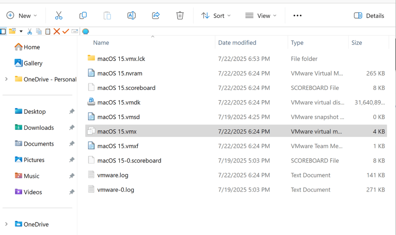

18. Search the .vmx file for "board-ID.reflectHost". Change the value to
    "FALSE". 

19. Search for "ethernet0.virtualDev". Change the value to "vmxnet3".

20. Add the following at the bottom of the file:

board-id = \"Mac-AA95B1DDAB278B95\"\
hw.model.reflectHost = \"FALSE\"\
hw.model = \"iMac20,1\"\
serialNumber.reflectHost = \"FALSE\"\
serialNumber = \"C01234567890\"

21. Save the file and exit your text editor.

22. Reopen VMware, right click on your MacOS15 virtual machine, go to Power, and click "Start up Guest".

23. Watch the fireworks!

Installing MacOS Sequoia

If you have gotten this far, you will see a lot of Mac fanboys eating their hats and saying that it isn't proper to run a Mac OS VM! They are all hurt that their greatest thing doesn't have to be run on overpriced Apple hardware!

1.  After the bootup process completes, you should have Mac OS Setup open up.

2.  Select the language that you want the Mac OS Sequoia VM to be in. Click "next". 
   
3.  Select Disk Utility and click on "Continue".
   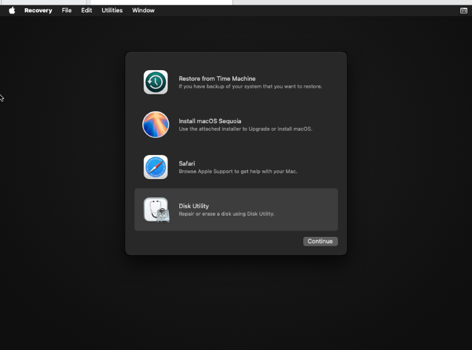

4.  On the left side, right click on "VMware Virtual SATA Hard Drive Media" and then click "erase".
   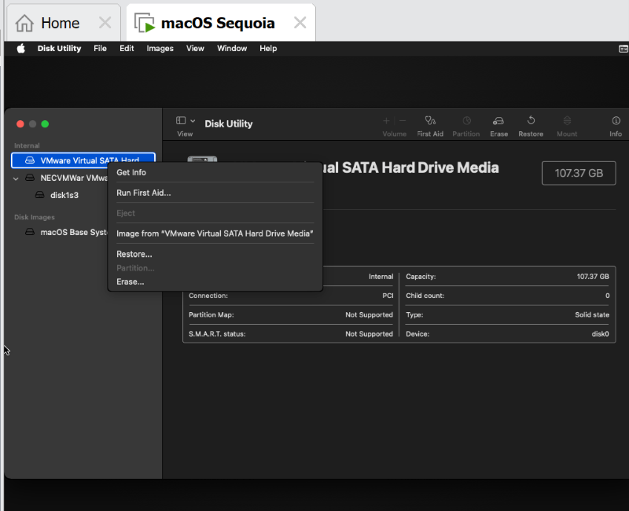

5.  Name the MacOS drive, make sure the format is "APFS", and Scheme is "GUID Partition Map" and click "Erase".
   

6.  Click "Done" and then close Disk Utility.
    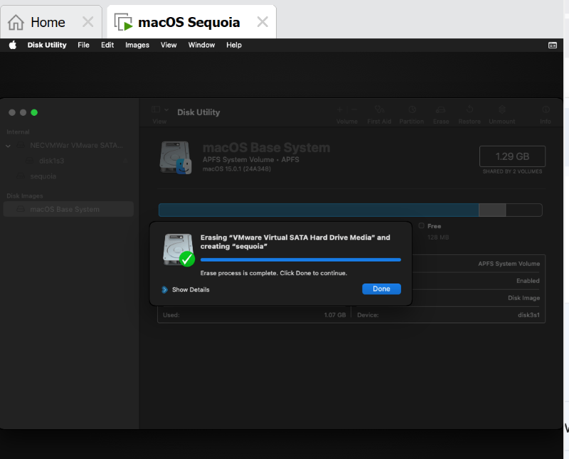
   

7.  Click "Install macOS Sequoia" and click "continue".
    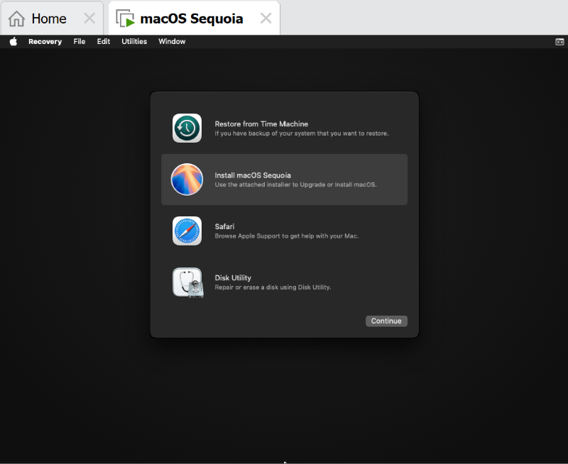

8.  Click Continue, click Agree, click Agree once more.
   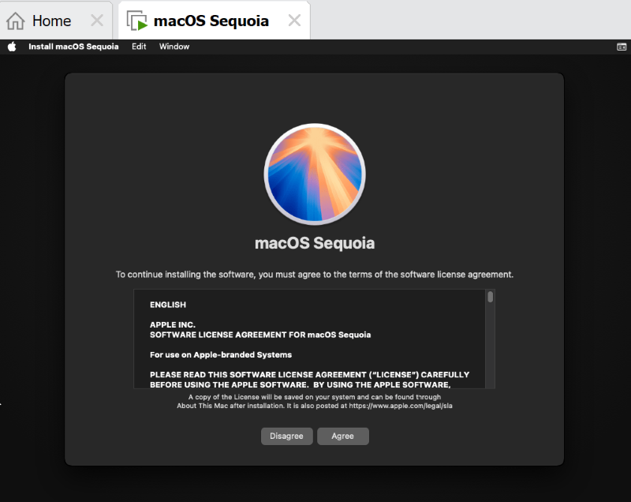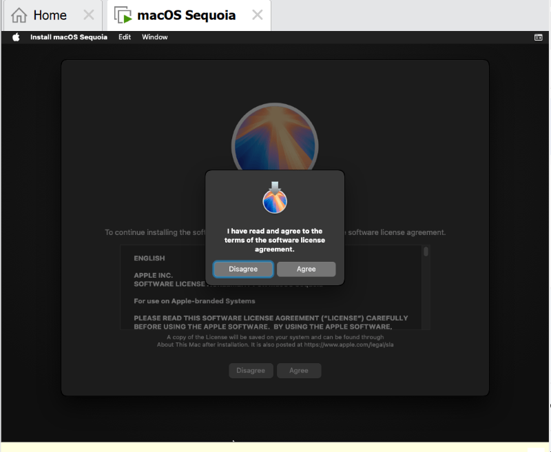
9.  Select the MacOS disk and then click on "install".

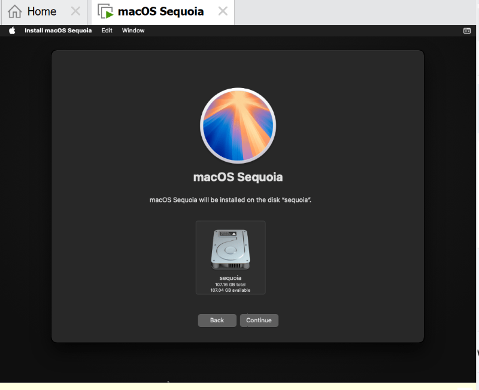

a.  Wait until the end of the world...errrr...ummm...for Sequoia to install. The VM will reboot a few times, you can go for a swim across the ocean, or something else while it takes forever to do the install. 

<!-- -->

10. Once the installation finishes (or you felt like you are going to die of old age), select the country/region you want to set the VM up in. You get bonus points for talking back to "Hal" as it talks to you when this comes up.
11. Select your language and keyboard layouts, then click "Continue".
    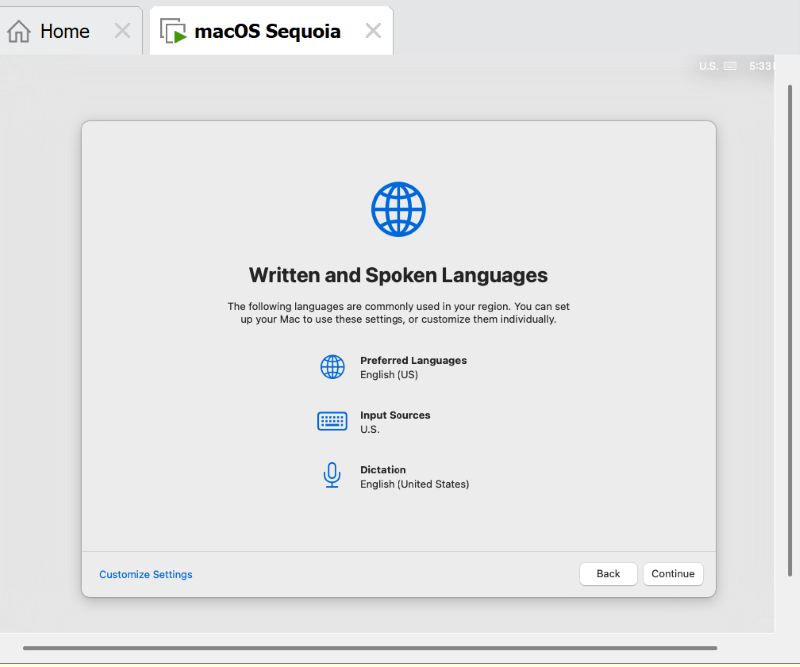

12. Click "Not now", "skip" or whatever your setup requires to bypass the Accessibility screen.
   

13. Do the same for the Data & Privacy screen -- well, do whatever you want to do here but I am not going to give Apple anything extra.
  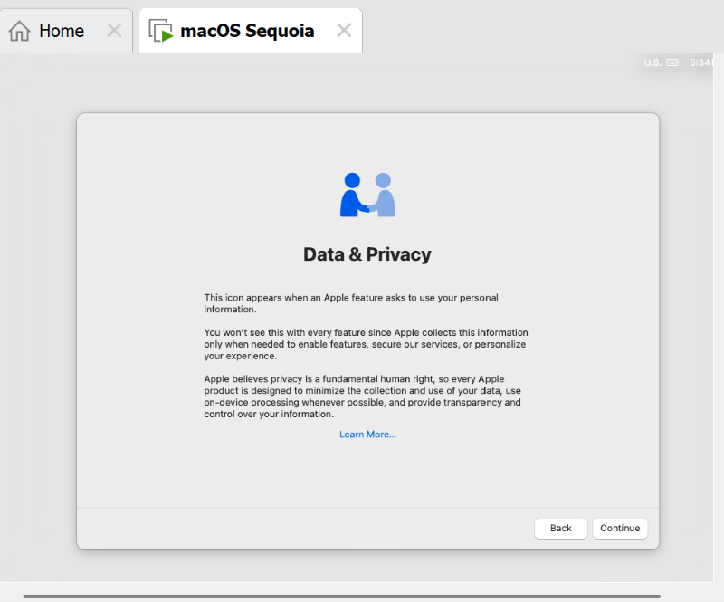
14. Select "Not now", "skip" or whatever choice your scree gives you for the "Migration Assistant" bit. I am not going to tell you what to do there. That is entirely up to you but I am not going to help you with this part no matter what mess you create.
  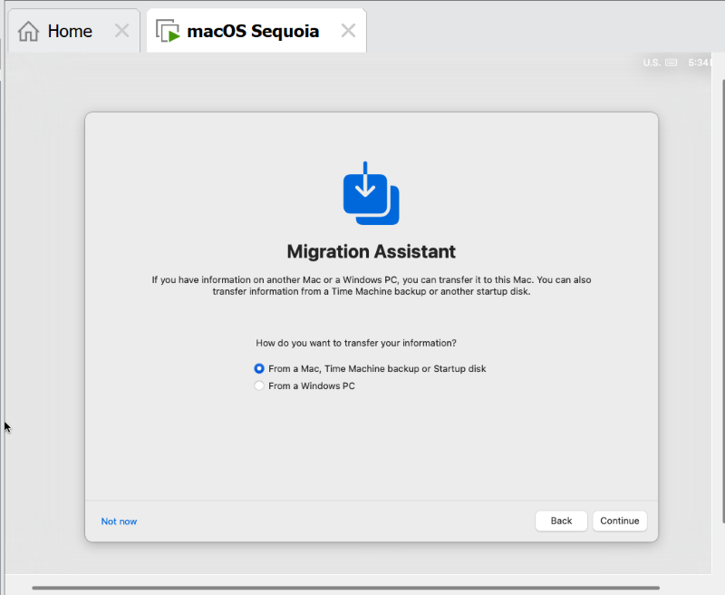
15. Select "Set up later" and "skip" the Apple ID screen. Why would you want to do something stupid like this?
   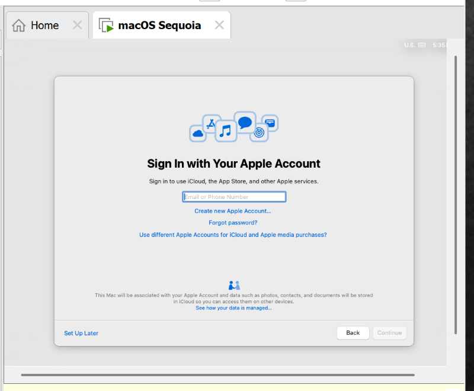

16. Click agree, and then agree once more. Apple wants you to be agreeing to everything that they want you to do no matter what your true feelings are.
   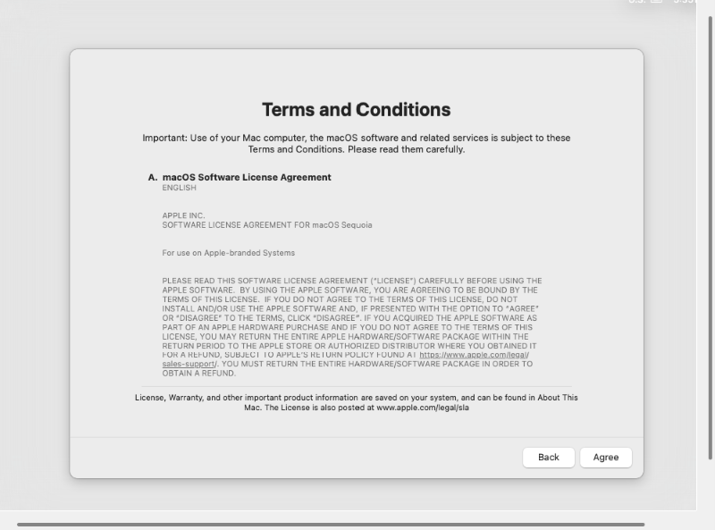!

17. Enter a name, username, and the password you want to use. Click "continue". It could take a bit of time to create the account.[image 39](image39.png)

18. Click continue, and then if you want to use or not use "Location Services". I don't use it; I want to be hidden away as best as I can be when I do something like this.
   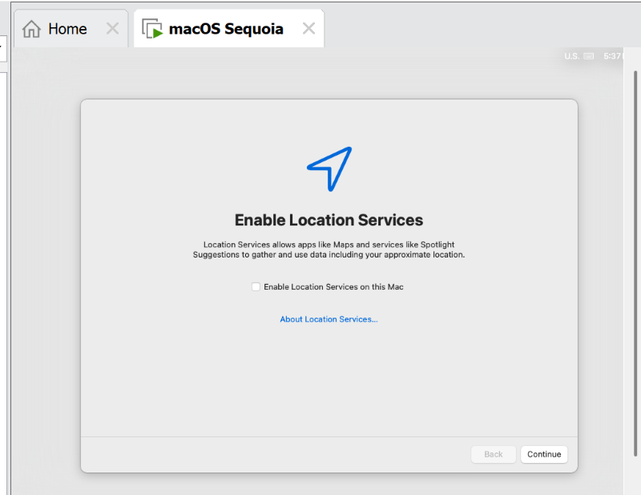

19. Pick the time zone you want to be using. Hey, US-based NFL fans. Did
    you know that you can set your time zone to Sydney Australia's on
    Super Bowl Sunday and learn the result of the game even before it is
    played in the US? Try it and find out!
    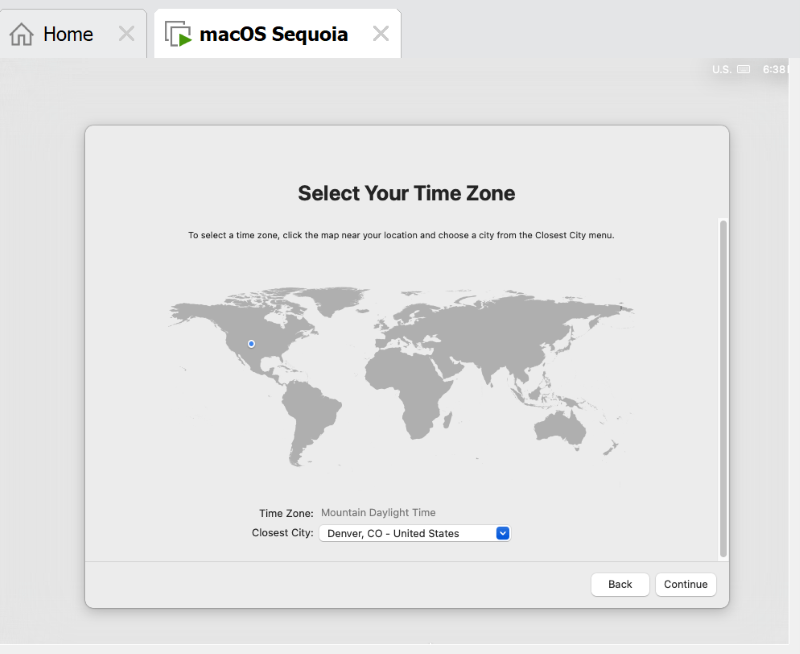
20. I unchecked the "Share Mac Analytics with Apple" faster than you
    could blink. I suggest you do the same.
    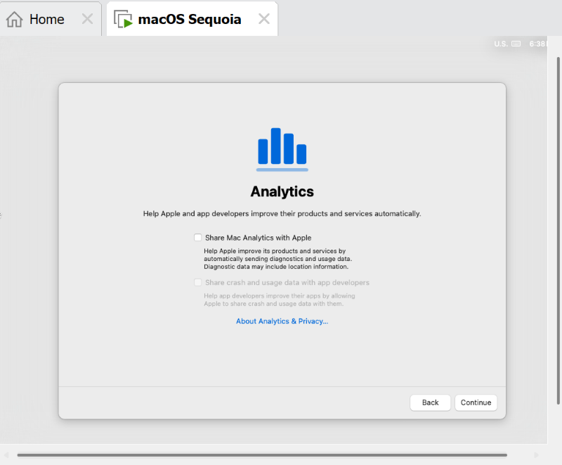

21. Click "set up later" on the Screen Time screen. Yeah, I will do that
    later....after this computer dies and is tossed in the trash.
   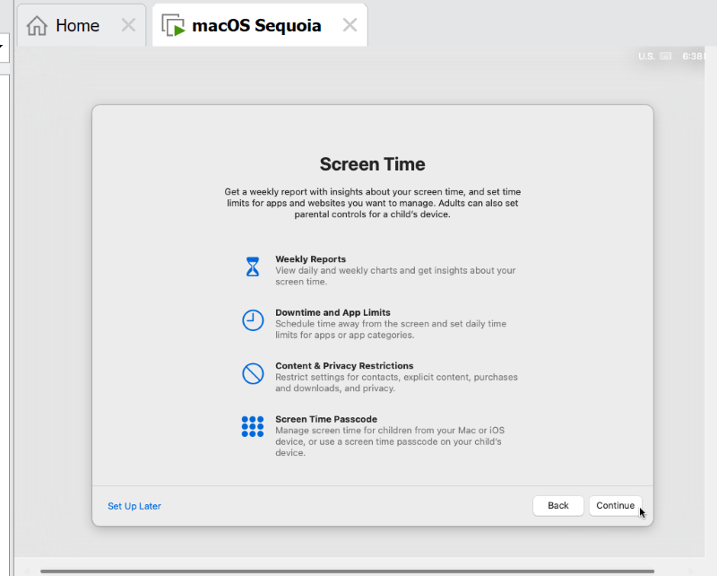

22. Pick a theme. Where is the Rocky 3 theme? How about Don't Worry, Be
    Happy? Oh, wait, this is a screen type theme. Choose the one that
    you want. 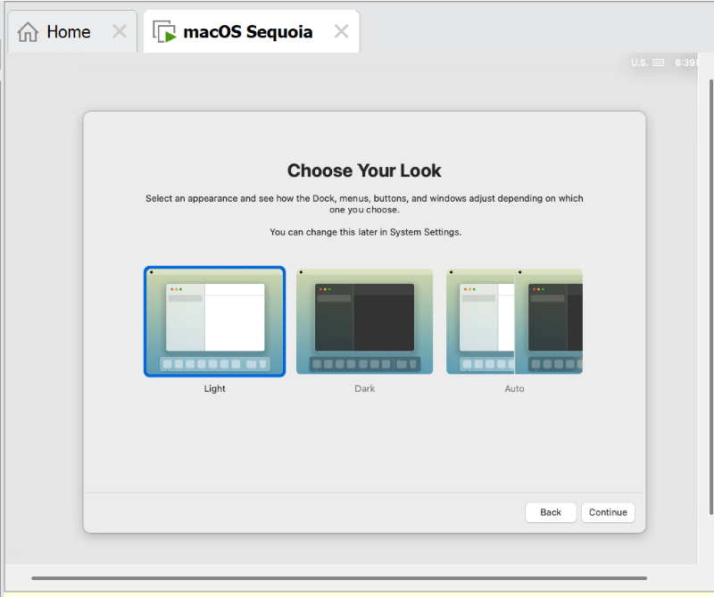

23. Welcome to the lunacy of Apple! You can now run a Mac Virtual
    Machine on your Windows PC and freak the Apple Fanboys out with
    having greater hardware on your Windows computer while doing the
    exact same things as those idiots can do with their overpriced
    machines! 

24. Once you are on the desktop, go to the top of VMWare window, select
    "VM" from the menu, and select "Install VMware Tools". In the
    virtual machine, select "Install VMware Tools".
    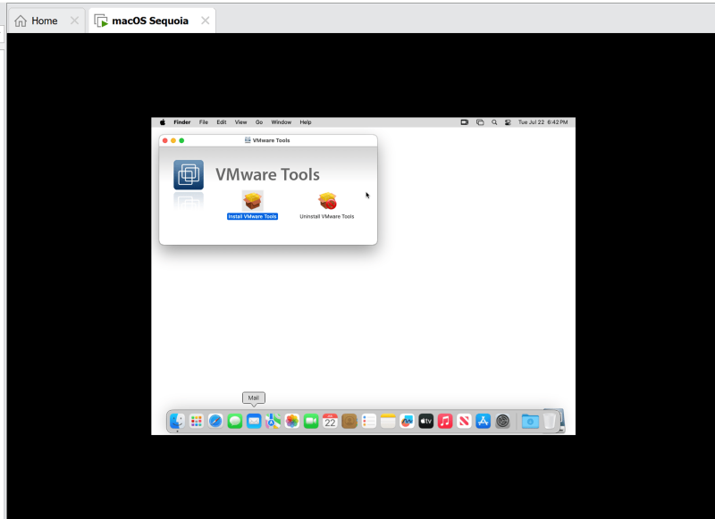

Good luck! Pretty soon you will be banging your head like you are
listening to Quiet Riot once more!

A link to those that don't know the pop culture reference of above:
https://www.youtube.com/watch?v=O_1ruZWJigo
