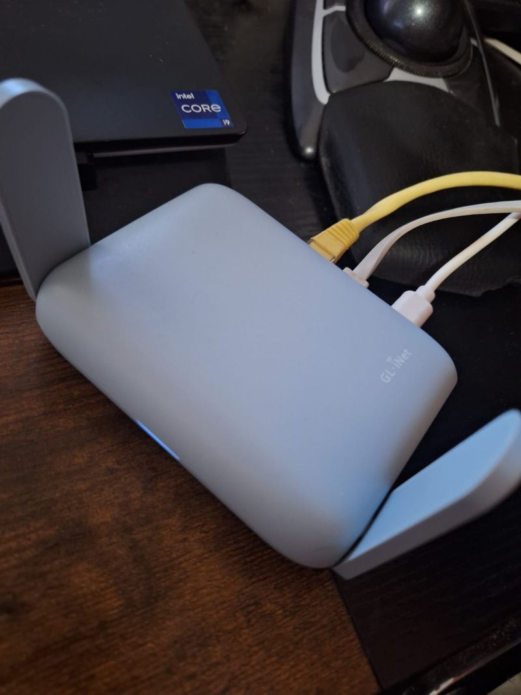

# 🌐 GL.iNet Beryl AX (GL-MT3000) Review

  

The **GL.iNet Beryl AX (GL-MT3000)** may not be the newest device on the market—with the Beryl 7 on the horizon—but it remains a staple in many digital nomads’ gear bags. I’ve used mine for years without issue, and it continues to be one of the most reliable budget VPN routers available.  

It’s compact, easy to set up, and perfect for situations where you need a secure, private network on the go. Whether you’re connecting in a hotel, café, or airport lounge, the Beryl AX gives you control and peace of mind.  

---

## Why Digital Nomads Love It

One of the biggest advantages is how it handles **captive portals** (those login pages you encounter on public Wi‑Fi). Instead of entering credentials on every device, you log in once through the router, and all your connected devices piggyback on that session. It saves time and frustration, especially when juggling laptops, tablets, and phones.  

It also doubles as a **VPN hub**. With built‑in support for WireGuard and OpenVPN, you can encrypt traffic for all devices at once. This is invaluable when working remotely in countries with restrictive networks or when handling sensitive client data.  

---

## Specs at a Glance

| **Specification**        | Details                                                                 |
|---------------------------|-------------------------------------------------------------------------|
| **Model**                | GL-MT3000 (Beryl AX)                                                    |
| **Wi-Fi Standard**       | Wi-Fi 6 (802.11ax), Dual-Band (2.4 GHz + 5 GHz)                         |
| **Wi-Fi Speed**          | Up to 574 Mbps (2.4 GHz) + 2402 Mbps (5 GHz) = AX3000 total             |
| **Processor (CPU)**      | MediaTek MT7981B, 1.3 GHz Dual-Core                                     |
| **RAM**                  | 512 MB                                                                 |
| **Storage**              | 256 MB NAND Flash                                                       |
| **WAN Port**             | 1 × 2.5 Gbps WAN                                                        |
| **LAN Port**             | 1 × 1 Gbps LAN                                                          |
| **USB Port**             | 1 × USB 3.0                                                             |
| **VPN Performance**      | OpenVPN up to 150 Mbps; WireGuard up to 300 Mbps                        |
| **Firmware**             | Based on OpenWrt (Linux-based, open-source, customizable)               |
| **Security Features**    | WPA3, VPN client/server, AdGuard Home, DNS over HTTPS/TLS               |
| **Size**                 | 105 × 90 × 40 mm (4.1 × 3.5 × 1.5 in)                                   |
| **Weight**               | 230 g (0.5 lbs)                                                         |
| **Power Supply**         | USB-C powered                                                           |
| **Special Features**     | OFDMA for efficient multi-device connectivity, advanced VPN support     |

---

## 🔑 Key Features

- **Wi-Fi 6 (AX3000 dual-band)** – Faster speeds and better efficiency compared to Wi-Fi 5.  
- **Ports** – 2.5Gbps WAN, 1Gbps LAN, and USB 3.0 for flexible connectivity.  
- **OpenWrt-based firmware** – Highly customizable with Luci, SSH, and advanced security features.  
- **VPN-ready** – Supports OpenVPN and WireGuard with hardware acceleration.  
- **Compact design** – Small enough to fit in a laptop bag or backpack.  

---

## 👍 Strengths

- Pocket-sized and lightweight, perfect for travel.  
- Solid throughput with reliable range for hotel rooms, apartments, and small offices.  
- Advanced security and customization via OpenWrt.  
- Strong VPN integration for secure browsing on public Wi-Fi.  
- Remote management with GoodCloud service.  

---

## 👎 Weaknesses

- Firmware updates often required out of the box.  
- No built-in battery, requires external power.  
- Range is limited for larger homes.  
- OpenWrt customization can be intimidating for beginners.  

---

## ⚖️ Comparison with Slate AX

- **Beryl AX vs Slate AX**:  
  - Beryl AX is smaller, lighter, and consumes less power.  
  - Slate AX offers slightly better range, but portability gives the Beryl AX an edge.  

---

## 🧳 Real-World Use Cases

- **Hotel Wi-Fi**: Connect once through the captive portal, then all devices stay online.  
- **Remote Work**: Run WireGuard to secure client data while working abroad.  
- **Streaming Abroad**: Use VPN to access geo-restricted content without configuring each device.  
- **Shared Spaces**: Create a private network in co-working spaces to isolate your devices.  

---

## 🏆 Overall Verdict

The **GL.iNet Beryl AX** is a **must-have travel router** for digital nomads, remote workers, and security-conscious travelers. Its combination of **Wi-Fi 6 speeds, VPN support, and OpenWrt flexibility** makes it stand out in the portable router market.  

While not ideal for large-scale home networking, it excels in its niche: **secure, portable connectivity on the go**. If you value privacy, convenience, and reliability, the Beryl AX deserves a permanent spot in your travel kit.
