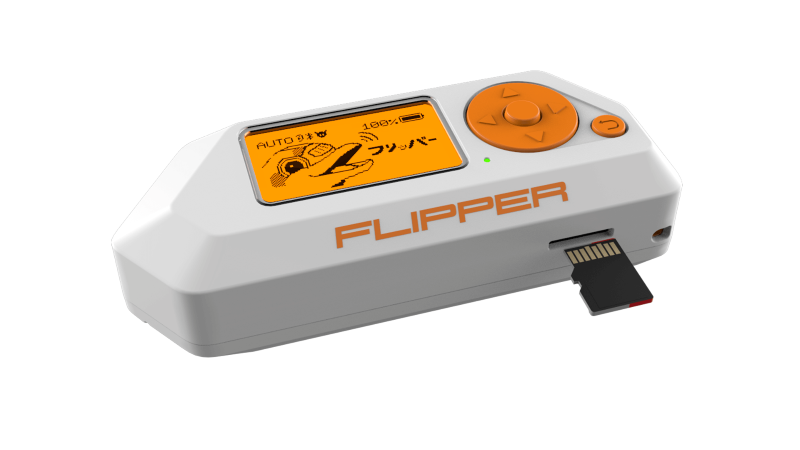
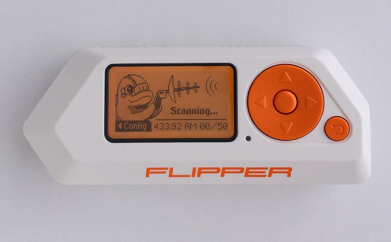

## Why Reset a Flipper Zero?

A friend of mine had their **Flipper Zero freeze up** unexpectedly. They asked me how to reset it, but the directions weren’t easy to find. Since this is a common issue—whether from forgotten PINs, firmware glitches, or lockups—I decided to document the process here for anyone searching online.  

Resetting can be done in two ways: a **manual button reset** or using the **qFlipper utility**.  

---

## Method 1: Manual Reset (Forgotten PIN or Frozen Device)

This is the quickest way to reset the Flipper without connecting it to a computer:  

| Step | Action |
|------|--------|
| 1 | Remove the microSD card from the device. |  |
| 2 | Hold the **UP** and **BACK** buttons simultaneously for about 30 seconds. |  |
| 3 | When prompted, press the **RIGHT** button to confirm the reset. | :) |

This clears the PIN and resets the device to default settings.  

---

## Method 2: Reset with qFlipper (Full Erase)

If the manual reset doesn’t work, you’ll need to use **qFlipper**, the official companion software:  

|||
|------|--------|
| Download qFlipper:| https://docs.flipper.net/zero/qflipper |
| Connect your Flipper Zero to your computer via USB. |  |
| Open **Advanced Controls** and click **Erase**. Confirm by clicking **Erase** again to start the reset process. |  |
| | |
| Once the reset is complete, click **Continue**. |  |

This method wipes the device completely, restoring it to factory defaults.  

---

## ✨ Did You Know? Flipper Zero Reset Insights

- 🔋 **Safe Reset** – Resetting doesn’t harm the hardware; it simply clears user data and settings.  
- 💾 **microSD Card** – Removing the card ensures logs and custom files aren’t corrupted during reset.  
- 🛠️ **Firmware Issues** – Many freezes are caused by outdated firmware; updating after reset often prevents recurrence.  
- 🔐 **PIN Reset** – Forgetting your PIN is one of the most common reasons users need this process.  
- 🌍 **Community Support** – The Flipper Zero Discord and GitHub repos are great resources for troubleshooting.  

---

## Reflection

The Flipper Zero is a versatile tool, but like any gadget, it can lock up or become inaccessible. Knowing how to reset it—whether through button combinations or qFlipper—saves time and frustration.  

For digital nomads, security researchers, or hobbyists, keeping your Flipper running smoothly means being prepared for the occasional hiccup. Resetting is simple once you know the steps, and documenting them ensures you won’t be stuck searching when you need it most.
