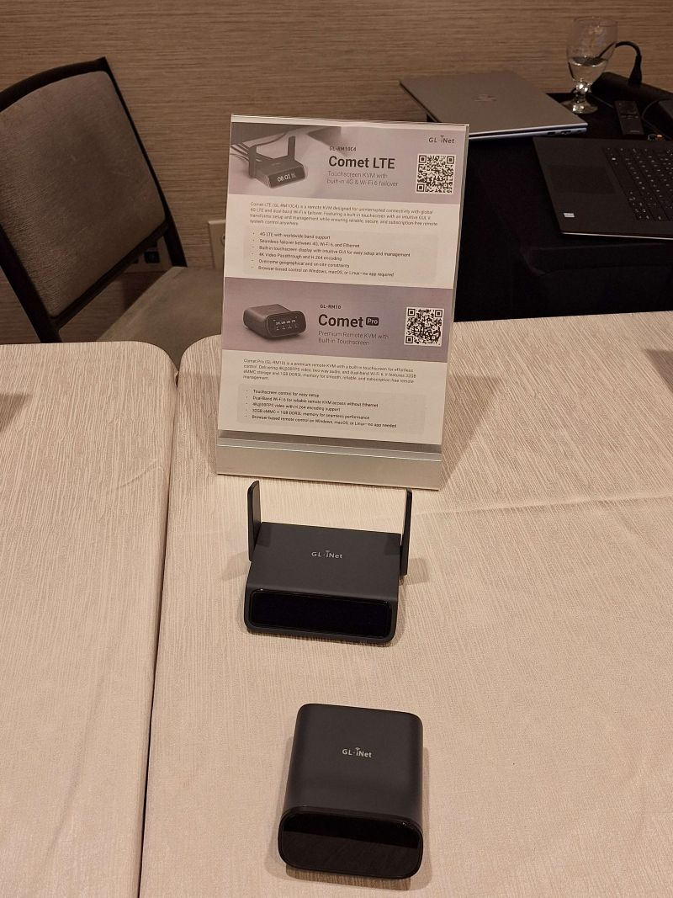
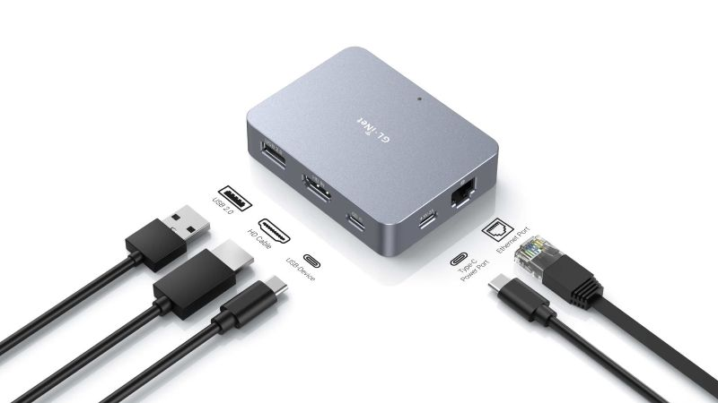
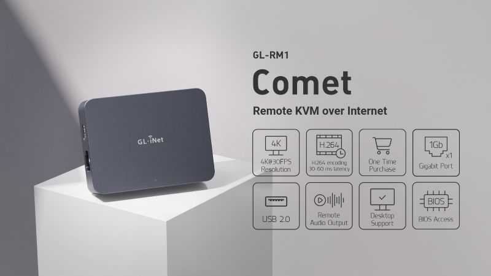
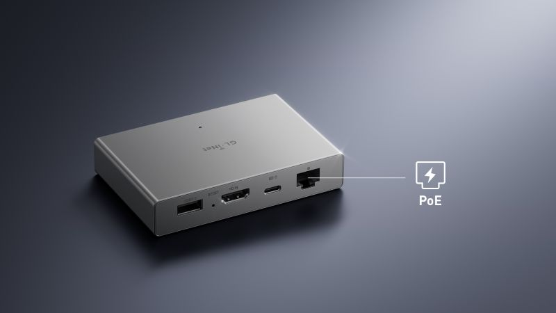
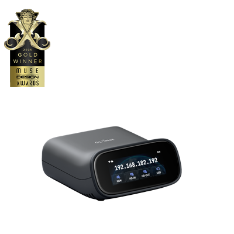

# Comparing GL.iNet’s Comet Series: GL-RM1, GL-RM1PE, and Comet Pro

Remote KVM devices are becoming essential tools for IT professionals, homelab enthusiasts, and enterprises alike. GL.iNet’s **Comet series** stands out for providing BIOS-level remote access without subscription fees, offering a hardware-based alternative to software solutions like TeamViewer or AnyDesk. Below, we’ll break down the differences between the three models, drawing on insights from multiple reviews.

  

---

## 📊 Comparison Chart

| Feature | Comet (GL-RM1) | Comet PoE (GL-RM1PE) | Comet Pro |
|---------|----------------|-----------------------|-----------|
| **Primary Use** | Affordable entry-level KVM-over-IP | Enterprise-ready with PoE support | Advanced remote management |
| **Processor** | ARM Cortex-A7 | ARM Cortex-A53 (faster, more efficient) | Higher-end processor |
| **Power Supply** | USB-C | Power-over-Ethernet (PoE) | USB-C with optional accessories |
| **Storage Capacity** | Standard | Expanded | Expanded with Pro-level options |
| **Connectivity** | USB, HDMI, Ethernet | USB, HDMI, Ethernet (PoE) | USB, HDMI, Ethernet, extended I/O |
| **Unique Features** | Plug-and-play, no subscription fees | First PoE-powered KVM solution | Enhanced tools, broader compatibility |
| **Target Audience** | Home labs, budget-conscious sysadmins | IT teams needing centralized power and performance | Enterprises and MSPs with advanced needs |
| **Price Range** | Entry-level | Mid-tier | Higher-tier |

---

## 🖥️ Comet (GL-RM1)

  
  

Reviews consistently praise the **GL-RM1** for being **affordable, compact, and easy to deploy**. TechRadar noted that it’s “small, inexpensive, and effective” while avoiding the subscription traps of software-based solutions. ServeTheHome highlighted its usefulness for consumer desktops that lack built-in iKVM controllers. For homelab users or sysadmins on a budget, this model delivers reliable remote BIOS-level access without frills.

**Buy on Amazon:** [GL.iNet Comet (GL-RM1)](https://amzn.to/4oCw3Vb)

---

## ⚡ Comet PoE (GL-RM1PE)

  
  

The **PoE edition** builds on the GL-RM1 by adding **Power-over-Ethernet support** and a stronger ARM Cortex-A53 processor. This makes it ideal for enterprise environments where centralized power delivery and higher performance are critical. TechRadar emphasized that while the base Comet is effective, the PoE model is “more powerful and might be worth the extra cost”. It’s the first KVM device in its class to integrate PoE, reducing cable clutter and simplifying deployment.

**Buy on Amazon:** [GL.iNet Comet PoE (GL-RM1PE)](https://amzn.to/4ayQlLF)

---

## 🚀 Comet Pro

  

The **Comet Pro** is designed for **power users and enterprises**. While reviews are still emerging, early impressions suggest it offers **expanded storage, enhanced connectivity, and broader compatibility**. It’s positioned as the premium option in the lineup, targeting managed service providers (MSPs) and IT teams who need advanced remote management features beyond the basics.

**Buy on Amazon:** [GL.iNet Comet Pro](https://amzn.to/4oCw3Vb) <!-- Replace with actual affiliate link when available -->

---

## 🌍 Benefits for Digital Nomads
One of the most exciting use cases for the Comet series is within the **Digital Nomad community**. By leaving a corporate workstation connected to a Comet device back home, professionals can travel the world while maintaining **secure, BIOS-level access** to their systems.  
- This setup avoids triggering **foreign travel alerts** that often occur when logging into corporate systems from abroad.  
- Instead, the Comet acts as a trusted bridge, allowing nomads to work remotely without raising red flags in corporate IT security systems.  
- The result: freedom to roam globally while staying seamlessly connected to essential work infrastructure.

---

## 🎮 Gaming Applications
Gamers can also benefit from the Comet series. Imagine leaving your **gaming rig at home**, connected to a Comet device:  
- You can remotely power on, manage, and access your system from anywhere in the world.  
- With the right streaming setup, you can **play games remotely** as if you were sitting in front of your PC.  
- This makes the Comet a powerful tool for those who want to enjoy high-performance gaming while traveling, without lugging around heavy hardware.  

---

## 🏢 Enterprise Administrator Use Cases
For enterprise administrators, the Comet series provides a **secure, hardware-level solution** for managing remote infrastructure:  
- **Remote BIOS-Level Control:** Admins can troubleshoot servers and desktops even when the OS is down, reducing downtime.  
- **Disaster Recovery:** If a system fails, administrators can remotely reinstall operating systems or repair configurations without needing physical access.  
- **Centralized Power Management:** With the PoE model, IT teams can deploy devices across data centers without additional power adapters, simplifying cabling and reducing points of failure.  
- **Audit-Friendly Operations:** The Comet’s hardware-based access ensures clear logging and accountability, aligning with compliance requirements.  
- **Scalability:** Enterprises can deploy multiple Comet devices across branch offices, giving administrators consistent remote access without relying on third-party subscription services.  

---

## 🧩 Comet Add-On Accessories

The Comet series can be paired with several accessories to expand its capabilities:

- **Fingerbot:** A tiny robotic actuator that can physically press buttons or switches. Perfect for automating power buttons on devices without remote control support.  
  **Buy on Amazon:** [Fingerbot](https://amzn.to/4pPUXBy)  

- **ATX Remote PC Power Control Board:** Allows administrators to remotely power cycle desktop PCs or servers, integrating seamlessly with Comet’s BIOS-level access.  
  **Buy on Amazon:** [ATX Remote PC Power Control Board](https://amzn.to/48EU87P)  

- **USB Switches & Extenders:** Useful for managing multiple peripherals or extending connectivity in enterprise setups.  

- **HDMI Capture Modules:** Enhance video quality for remote sessions, especially in gaming or high-resolution environments.  

- **Additional Recommended Accessory:** A versatile add-on that complements the Comet ecosystem for extended remote management.  
  **Buy on Amazon:** [Accessory Link](https://amzn.to/4rIFTHF)  

These add-ons make the Comet not just a remote access tool, but a **complete remote management ecosystem**.

---

## 🔧 Workflow Integration Guide

### Homelab Pipelines
- **Use Case:** Affordable, plug-and-play BIOS-level access for personal servers.  
- **Workflow Fit:** Comet GL-RM1 integrates into modular homelab setups, enabling remote troubleshooting without subscription costs.  
- **Benefit:** Transparent, auditable control for hobbyists and sysadmins experimenting with automation pipelines.  

### Enterprise IT Pipelines
- **Use Case:** Large-scale infrastructure management across data centers and branch offices.  
- **Workflow Fit:** Comet PoE (GL-RM1PE) simplifies deployment with centralized power and stronger hardware.  
- **Benefit:** Reduces downtime, supports compliance, and integrates seamlessly into enterprise monitoring and disaster recovery workflows.  

### MSP (Managed Service Provider) Pipelines
- **Use Case:** Remote management of client systems across multiple environments.  
- **Workflow Fit:** Comet Pro provides advanced connectivity, expanded storage, and compatibility for diverse client infrastructures.  
- **Benefit:** Enables MSPs to deliver reliable, subscription-free remote support, with clear audit trails for accountability.  

---
