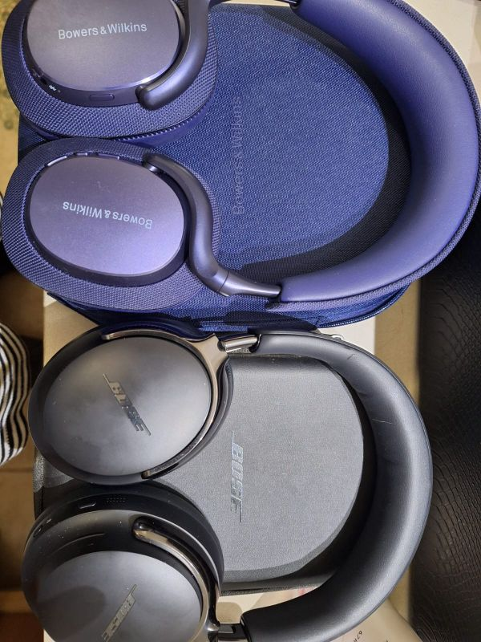
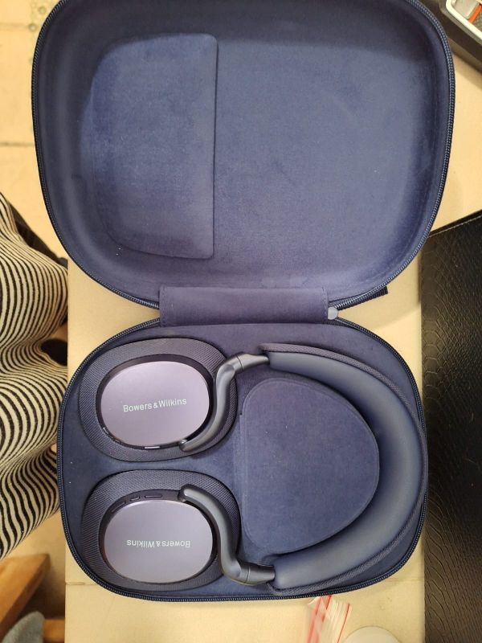
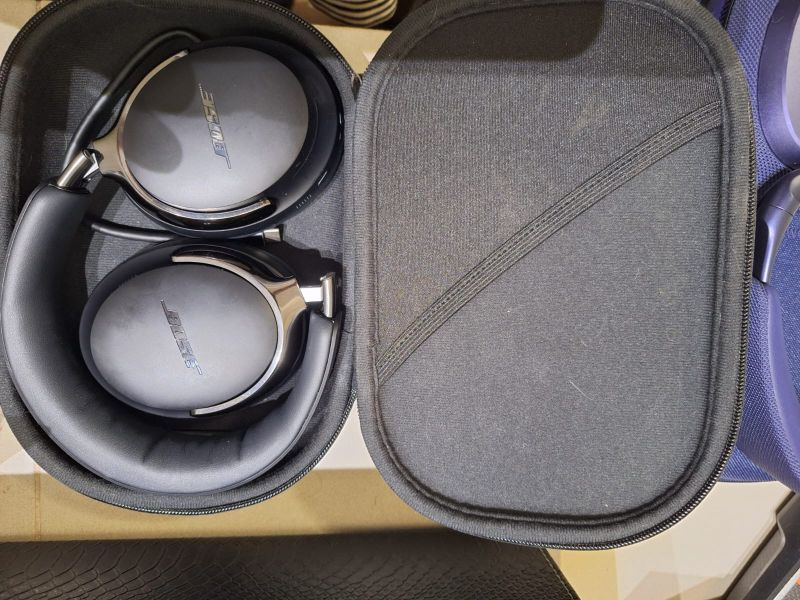

# Bowers & Wilkins Px7 S3 vs. Bose QuietComfort Ultra 2
  

## A Real-World Comparison for People Who Actually Care About Sound

There’s an old joke in audio circles: “If you want no highs and no lows, buy Bose.”  
It’s been repeated for decades—mostly by people who haven’t listened to a modern pair of Bose headphones. The punchline doesn’t really land anymore, especially with the QuietComfort line. Bose has quietly built a reputation for warm, pleasant, genuinely enjoyable sound with their headphones.

But when you compare them to something like the Bowers & Wilkins Px7 S3, you’re stepping into a different league of tuning philosophy. One is built for musicality and detail; the other is built for silence, comfort, and everyday practicality.

Both are excellent—but for very different reasons.

To make the differences clear, here’s a structured, real-world comparison that focuses on what you actually experience when you wear them.

---

# Sound Quality: Two Different Listening Philosophies

Before diving into the tables, it’s worth stating the obvious: these headphones are tuned for different listeners. The Px7 S3 reward focused listening. The QC Ultra 2 reward casual enjoyment. Neither is “wrong”—they’re just aiming at different targets.

# So, how good is Bose vs. B&W?  

Well, back in 1997, I had saved for a year to buy a set of Bose 901 speakers.  I got them home and loved them so much that I decided I wanted to get a pair of rear channel speakers so I could have surround sound.  

My then GF and I saved up enough for me to buy a cheap pair of rear speakers to add to the mix.  We went into Hudson's audio in Albuquerque to get an idea of how much it would cost to get new speakers.  When I went inside, I commented to Nancy that I really liked the sound of the speakers that were playing.  Nancy commented something along the lines of "yeah, and I bet it is the $5000 set of speakers".  The salesman heard that and said, "no, those are the $200 used set of speakers."  Nancy immediately pulled out the checkbook.

After getting them home, we noticed that the sound of the B&W 602 speakers sounded better than the Bose 901s.  I sold the 901s and bought B&W 605 speakers as replacements.  Ever since I have been a B&W fan.  

For me, I prefer the B&W speaker but everyone's head is different.  You need to listen to them yourself to find the one that fits your needs/desires.

## Sound Quality Comparison

| Feature | B&W Px7 S3 | Bose QC Ultra 2 |
|--------|-------------|------------------|
| Overall Tuning | Audiophile-leaning, detail-first | Warm, smooth, universally pleasant |
| Bass | Tight, controlled | Full, rounded |
| Mids | Clean, textured | Smooth, relaxed |
| Treble | Crisp, not harsh | Soft, non-fatiguing |
| Soundstage / Separation | Spacious, layered | More intimate |
| Extras | None | Optional spatial audio |

The Px7 S3 are the headphones you sit down with.  
The QC Ultra 2 are the headphones you live with.

---

# Noise Cancelling: Bose Still Owns This Category
  

This is the category where Bose has built its empire. The Ultra 2 continue that legacy with ANC that feels like a “mute button for the world.” B&W’s ANC is good—but it’s not trying to compete with Bose’s dominance.

## ANC Comparison

| Feature | B&W Px7 S3 | Bose QC Ultra 2 |
|--------|-------------|------------------|
| ANC Strength | Good, respectable | Industry-leading |
| ANC Profiles | Basic | Customizable |
| Isolation | Reduces distractions | Excellent for travel and offices |
| Philosophy | Music first, ANC second | Silence first, music second |

If ANC is your top priority, this category is an easy win for Bose.

---

# Portability and Comfort: A Clear Divide

This is where the design philosophies really diverge. Bose optimizes for comfort and portability. B&W optimizes for premium feel and presence.

## Portability and Comfort Comparison

| Feature | B&W Px7 S3 | Bose QC Ultra 2 |
|--------|-------------|------------------|
| Weight | Heavier, more substantial | Noticeably lighter |
| Folding Mechanism | Rotates flat only | Fully folds compactly |
| Clamp and Pads | Premium but firmer | Softer, more forgiving |
| Travel Friendliness | Bulkier in a bag | Ideal for travel and daily carry |

If you’re hopping between airports, trains, and coffee shops, Bose is the more practical companion.

---

# Build Quality and Materials: Luxury vs. Lightweight

Bowers & Wilkins leans into premium materials and design. Bose leans into comfort and weight reduction. Both approaches make sense for their intended audience.

## Build Quality Comparison

| Feature | B&W Px7 S3 | Bose QC Ultra 2 |
|--------|-------------|------------------|
| Materials | Metal, fabric, premium finishes | Lightweight plastics |
| Feel | High-end, luxury | Functional, comfort-first |
| Durability Impression | Solid, substantial | Light but well-constructed |

The Px7 S3 feel like a luxury product.  
The QC Ultra 2 feel like something you can wear for hours without thinking about them.

---

# Battery Life: Consistency vs. Flexibility

Both deliver solid performance, but B&W edges ahead with consistency.

## Battery Life Comparison

| Feature | B&W Px7 S3 | Bose QC Ultra 2 |
|--------|-------------|------------------|
| Rated Battery Life | ~30 hours | Good, varies with features |
| Impact of Features | Minimal | Spatial audio and ANC reduce runtime |

If you want predictable battery life, B&W wins.  
If you want features like spatial audio, Bose gives you more—but at a cost.

---

# Codec Support: The Quiet Dealbreaker

This is the category that quietly matters to people who actually care about fidelity. And here, the Px7 S3 are in a different league.

## Codec Support Comparison

| Codec Support | B&W Px7 S3 | Bose QC Ultra 2 |
|---------------|-------------|------------------|
| SBC | Yes | Yes |
| AAC | Yes | Yes |
| aptX HD | Yes | No |
| aptX Adaptive | Yes | No |
| aptX Lossless | Yes (when supported) | No |
| Wireless Fidelity | High-end | Standard |

If you’re streaming high-quality audio from a device that supports aptX Adaptive or Lossless, the Px7 S3 give you noticeably more headroom.

---

# Final Verdict: Two Great Headphones, Two Different Audiences

After living with both, the conclusion is straightforward:

## Choose the Bowers & Wilkins Px7 S3 if you want:
- The best sound quality in this comparison  
- Richer detail, better separation, and more emotional engagement  
- Premium materials and a luxury feel  
- High-end codec support  

## Choose the Bose QuietComfort Ultra 2 if you want:
- The best noise cancelling available today  
- Maximum comfort for long sessions  
- A lighter, more portable design  
- A warm, easy-to-love sound signature  

Both are excellent—but they’re built with different priorities in mind.  
Your choice depends on what you value when you press play.
