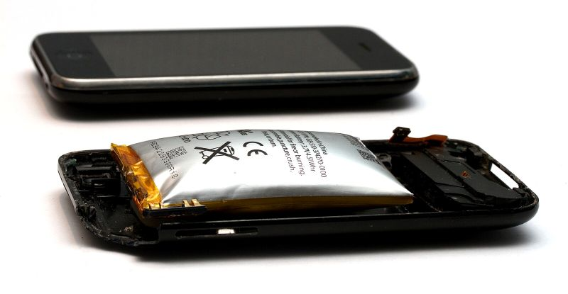
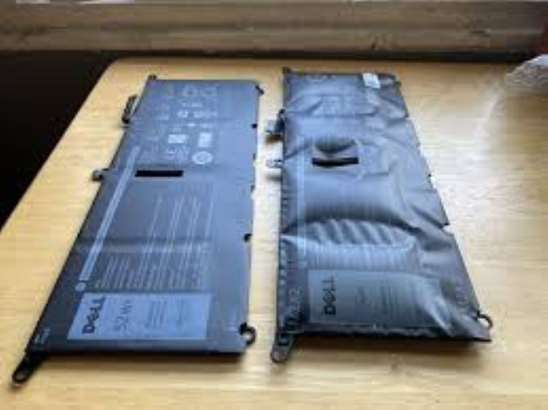
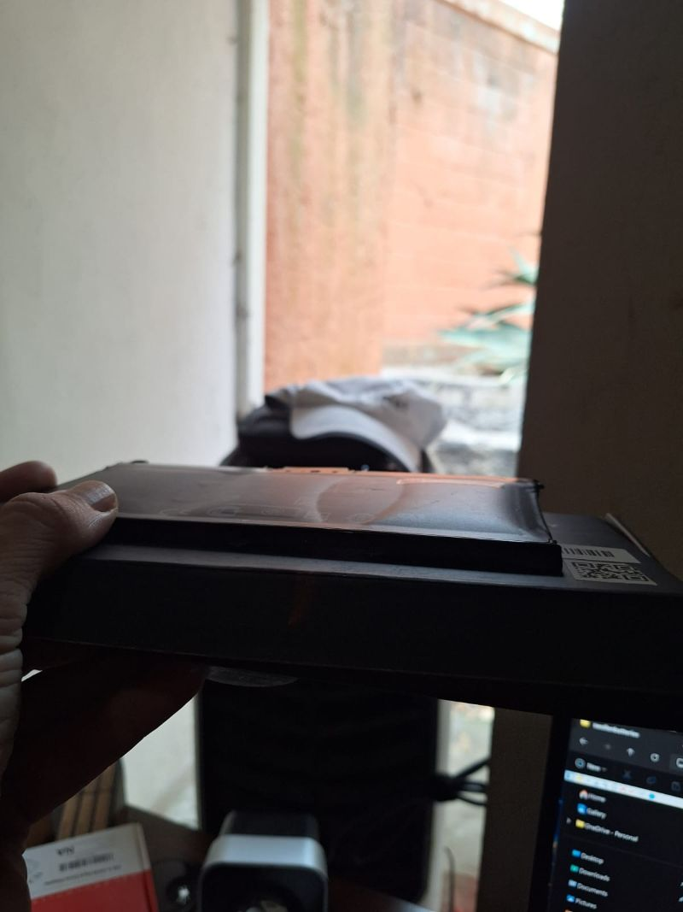

Recently I have come across a very dangerous issue a couple of times that I feel should be talked about because it is so critical and is often overlooked—swollen batteries in electronics.  

In the last two weeks, I have found **five instances of swollen batteries** in the local area, and each was a danger to the person and their property. Of those five cases:  
- One device shorted out and was damaged beyond repair.  
- Another had problems with the touchpad on a laptop.  
- The other three users had no idea they were suffering from swollen batteries; they just thought their devices wouldn’t hold a charge.  

---
## ❓ Just How Dangerous Is This Hazard?

<!-- Battery fire YouTube Shorts -->
<iframe width="560" height="315" 
  src="https://www.youtube.com/embed/XohCqLq0hUk" 
  frameborder="0" 
  allowfullscreen>
</iframe>  

While it might seem like a small hazard, they can result is serious damages...  

<!-- Fourth video -->
<iframe width="560" height="315" 
  src="https://www.youtube.com/embed/IAAxeXhmQuE" 
  frameborder="0" 
  allowfullscreen>
</iframe>

---

## 🔋 What Is a Swollen Battery?
A swollen battery is a lithium-ion or lithium-polymer cell that has expanded beyond its normal size. This swelling happens because chemical reactions inside the battery release gases, which get trapped and cause the casing to bulge.  

You might notice your device’s case separating, a screen lifting, or the battery itself looking puffed up.  

  
  

---

## ⚙️ What Causes Battery Swelling?
- **Overcharging**: Keeping a device plugged in after reaching 100% stresses the battery and accelerates gas buildup.  
- **Heat exposure**: High temperatures damage the internal chemistry.  
- **Aging**: As batteries wear out, their ability to hold charge declines, increasing the risk of swelling.  
- **Physical damage**: Drops, punctures, or manufacturing defects can destabilize the battery’s cells.  
- **Poor charging habits**: Using cheap or faulty chargers can disrupt voltage regulation.  

---

## 🚨 Dangers of a Swollen Battery
- **Fire and explosion risk**: The pressure inside can rupture the casing, leading to combustion.  
- **Device damage**: Swelling can warp or crack screens, keyboards, and internal components.  
- **Toxic fumes**: If punctured, the battery may release harmful chemicals that irritate lungs and skin.  
- **Environmental hazard**: Improper disposal contaminates soil and water, since batteries are classified as hazardous waste.  

### Real-World Incidents
- **E-bike Fires**: The U.S. Consumer Product Safety Commission reported dozens of fires linked to lithium-ion batteries, causing hundreds of thousands in property damage.  
- **Consumer Electronics**: FEMA notes that overcharging and overheating are leading causes of lithium-ion battery accidents, often resulting in fires in laptops, phones, and tablets.  
- **Air Travel**: Airlines report multiple lithium-ion battery incidents per week, underscoring how common and dangerous these failures are.  

---

## 👀 Signs of a Swollen Battery
- **Physical Bulging**: The battery looks puffed up or bloated compared to normal.  
- **Device Separation**: The back cover or seams of your device start to split apart.  
- **Screen Issues**: The display may lift, warp, or crack due to internal pressure.  
- **Keyboard/Trackpad Malfunction**: In laptops, swelling presses against input devices, making them stiff or unresponsive.  
- **Unusual Feel**: The device rocks on a flat surface or feels thicker than usual.  
- **Odor or Heat**: A chemical smell or unusual warmth when idle can indicate breakdown.  
- **Cracks in Case/Phone**: Physical damage to the casing as the battery pushes outward, stressing the frame and glass.  

---

## ✅ What To Do If You Have a Swollen Battery
- **Stop using the device immediately**. Do not charge or power it on.  
- **Do not puncture or compress the battery**—this can trigger fire or explosion.  
- **Handle with care**: If the device feels hot or emits odors, move it away from flammable materials.  
- **Seek professional help**: Contact me or your trusted local technician to safely remove and replace swollen batteries.  
- **Dispose properly**: Take the battery to an authorized recycling center or hazardous waste facility. Never throw it in household trash.  
             
---

## 🛠️ Final Word
A swollen battery is a ticking time bomb. Treat it as an emergency, not a minor annoyance. If you see signs of swelling, **contact me or your favorite local technician right away**—we’ll make sure it’s handled safely and your device gets back to working condition without putting your home or health at risk.
