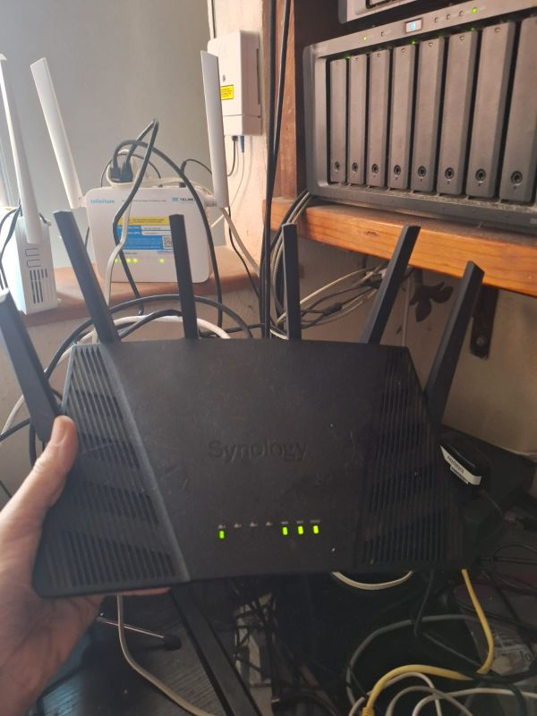
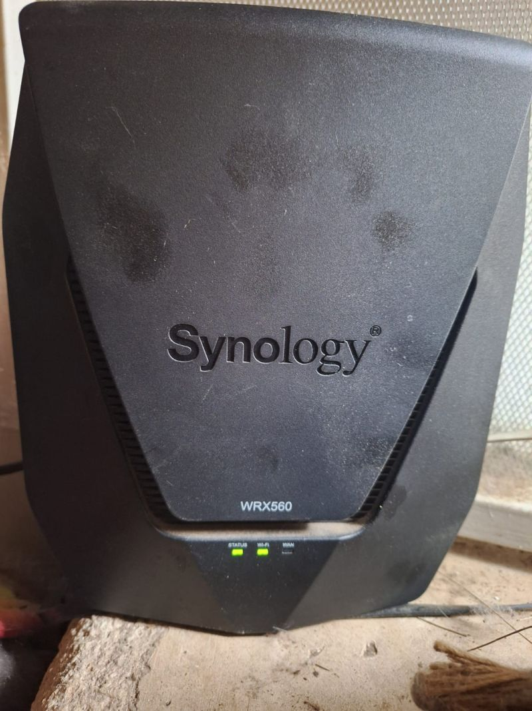
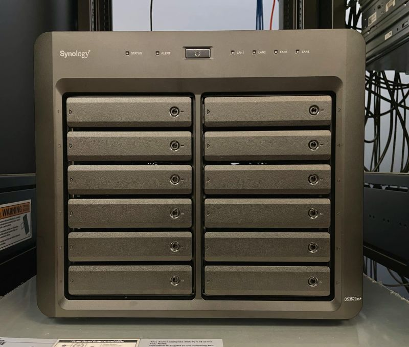
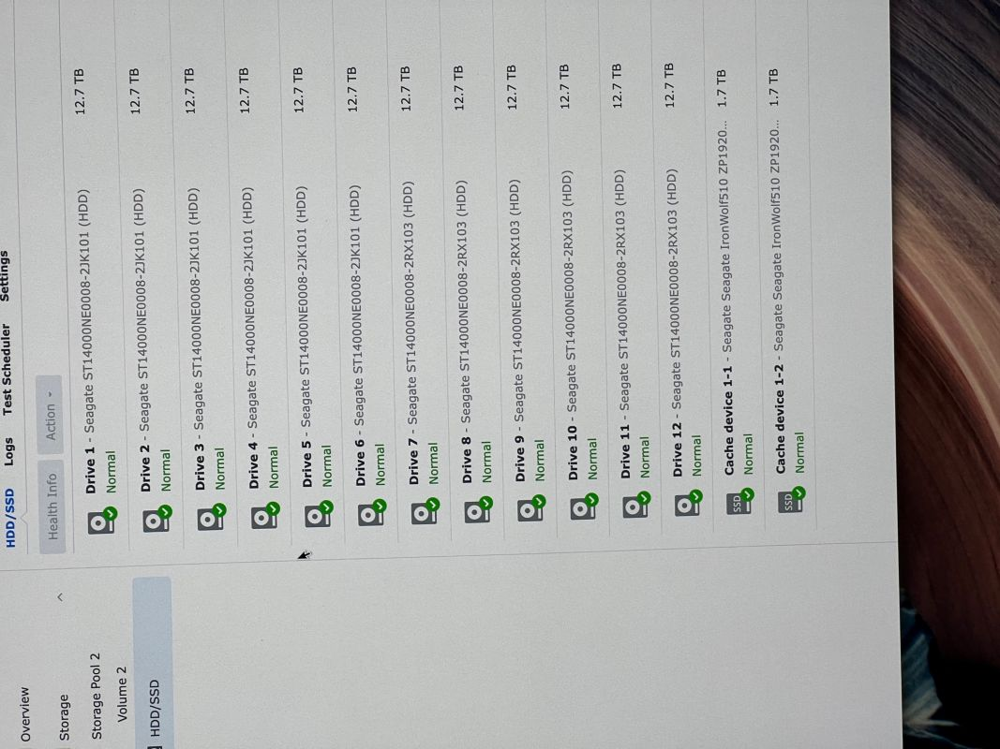
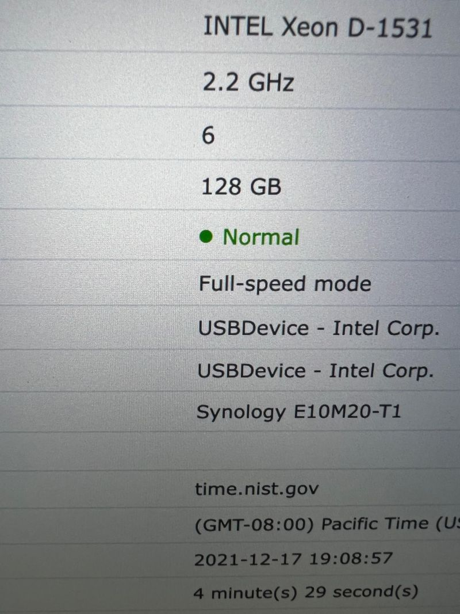
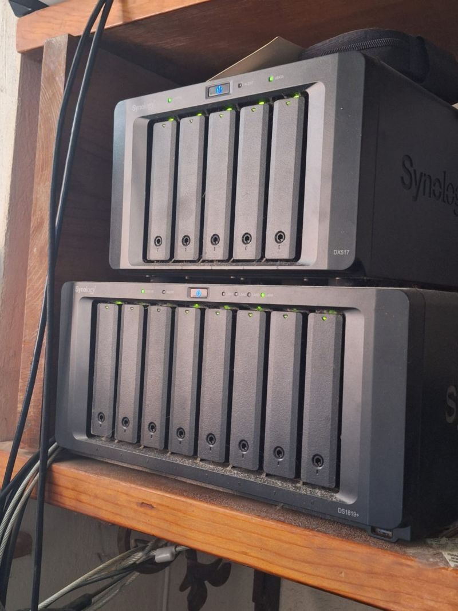

# When Trust Breaks: My Disillusionment with Synology  

## From Enthusiast to Skeptic  
For years, I was a Synology fan. I bought their products, recommended them to friends and clients, and even paid a premium for their routers because I believed in their ecosystem. Their hardware was more expensive than most, but I trusted the brand and thought the investment was worth it. Synology wasn’t just another vendor — they were a company I felt confident standing behind.  

## The Router Stagnation  

  
NOTE:  My RT-6600ax at my home in Mexico.   
  

NOTE: One of my 4 WRX560 routers at my home in Mexico.  Sorry, I hadn't been there in awhile and the maid didn't bother cleaning them while I was gone.  

That confidence began to erode with the release of the [RT-6600ax](https://www.synology.com/en-global/products/RT6600ax). Synology had finally entered the Wi-Fi 6 era, but since then, nothing. No Wi-Fi 6E, no Wi-Fi 7, no roadmap, no upgrade path.  

Community members have noted that Synology’s router lineup has seen **no meaningful updates since 2022**, with only bug fixes and no new features. Even the WRX560, launched in late 2022, was criticized as “a great router of yesteryear” because Wi-Fi 6E and Wi-Fi 7 were already mainstream.  

Whenever I asked Synology about future router offerings, I heard nothing but silence. The lack of communication was deafening, and it left a sour taste in my mouth. I stopped recommending Synology’s router line after that — how could I advise clients to invest in a platform that seemed abandoned?  

## NAS and the Drive Lock-In  
Despite my disappointment with their routers, I continued to support Synology’s NAS line. Their software was polished, their hardware reliable. I countinued to buy their NAS devices and upgraded them in whatever ways I could.  My DS3622xs had 12x 14TB hard drives in it and I upgraded the RAM to 128GB.  That is more than Synology said was able to be in it.  
  
  

But then came the decision that NAS units would only support **Synology-branded drives**.  

In 2021, Synology introduced compatibility restrictions in DSM 7, requiring Synology-branded drives for certain enterprise NAS models ([Ars Technica coverage](https://arstechnica.com/gadgets/2021/06/synology-nas-dsm-7-0-released/)). Customers saw it for what it was: corporate greed.  

The backlash was swift. Synology faced **plummeting sales and intense customer criticism**, forcing them to walk back the policy later. With DSM 7.3, Synology restored support for third-party drives like WD Red and Seagate ([TechPowerUp report](https://www.techpowerup.com/315014/synology-dsm-7-3-restores-third-party-drive-support)). But for many of us, the damage was already done. Trust, once broken, is not easily repaired.  

## The Cost of Corporate Greed  
Corporate greed erodes customer loyalty. It tells users that the company values profit over trust. History is full of examples:  

- **Kodak** clung to film profits and ignored digital photography, losing their dominance.  
- **BlackBerry** prioritized enterprise lock-in over consumer innovation, and the market moved on.  
- **Intel** resisted embracing mobile processors, ceding ground to ARM-based competitors.  

Synology’s attempt to lock users into branded drives was cut from the same cloth. Even if they reversed course, the betrayal lingers. Once a company shows its hand, customers know where their priorities lie.  

## Personal Anecdote: A Client’s Router Regret  
I remember recommending Synology routers to a client who wanted a reliable, enterprise-grade solution. They trusted my advice and invested in the RT-6600ax, expecting years of updates and support.  I believed that, while late, Synology would come out with a WiFi 6e solution soon.  
 
When Synology shifted focus and left the router line stagnant, that client was left with aging hardware and no clear upgrade path. It was embarrassing to admit that the brand I had vouched for had abandoned innovation. That experience reinforced my decision to stop recommending Synology altogether.  

## Future Outlook: What Synology Should Do  
If Synology wants to regain trust, they need to:  
- **Publish clear roadmaps** for routers and NAS hardware.  
- **Commit to open compatibility** with third-party drives.  
- **Innovate in networking** by embracing Wi-Fi 6E and Wi-Fi 7.  
- **Communicate transparently** with customers instead of leaving them in the dark.  

Without these steps, Synology risks fading into irrelevance as competitors continue to innovate.  

## Competitor Alternatives  
If you’re considering alternatives, here’s a quick comparison:  

| Brand      | Router Innovation | NAS Drive Policy | Software Ecosystem | Notes |
|------------|------------------|------------------|--------------------|-------|
| **Synology** | Stagnant since Wi-Fi 6 | Attempted lock-in, later walked back | DSM (polished, but trust issues) | Trust broken for many users |
| **QNAP**    | Frequent updates, Wi-Fi 6E/7 | Broad third-party drive support | QTS, feature-rich | More aggressive innovation |
| **ASUS**    | Leading Wi-Fi 6E/7 routers | N/A (router-only) | AiMesh ecosystem | Strong consumer router lineup |
| **Netgear** | Cutting-edge Wi-Fi 7 | N/A (router-only) | Nighthawk ecosystem | Widely available, strong support |

 

<section id="my-path-forward">
  <h2>My Path Forward</h2>
  
The only Synology products I still use are the ones I already own. But when they die or age out of usefulness, I will replace them with other brands. Synology had my loyalty once, but corporate greed and stagnation cost them that loyalty forever.

  
I no longer recommend their products. I no longer trust their vision. And I believe this story is a reminder to all of us: when companies put profit above trust, they lose the very foundation of their success.

</section>

<section id="reader-call-to-action">
  <h2>Reader Call-to-Action</h2>
  
Have you had similar experiences with Synology or other companies that put profit above trust? Share your story in the comments — let’s hold corporations accountable together.

</section>

For me, the Synology ship has sailed and I will not be making another voyage on the line again.

