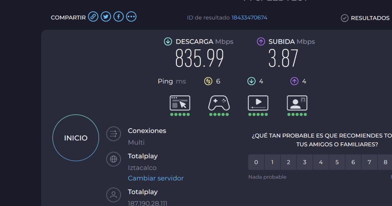
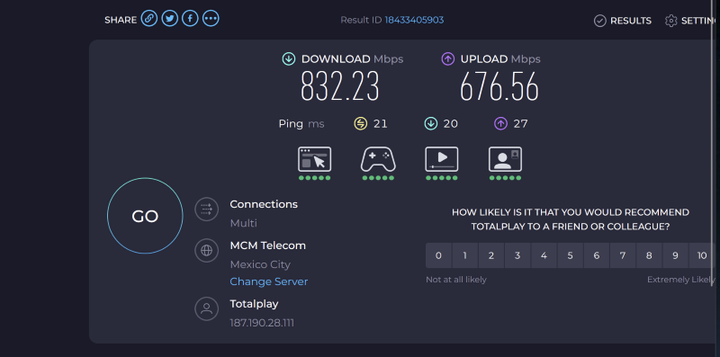
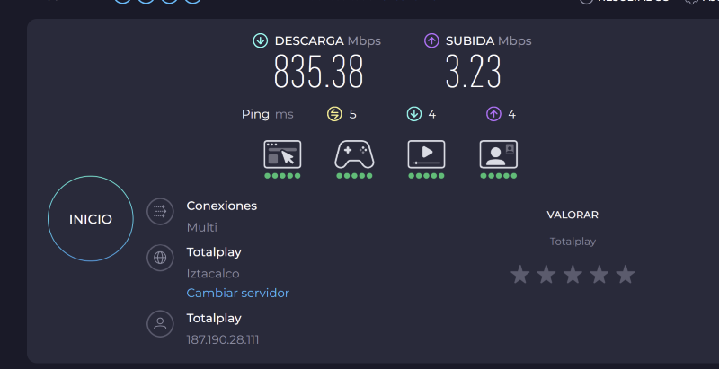
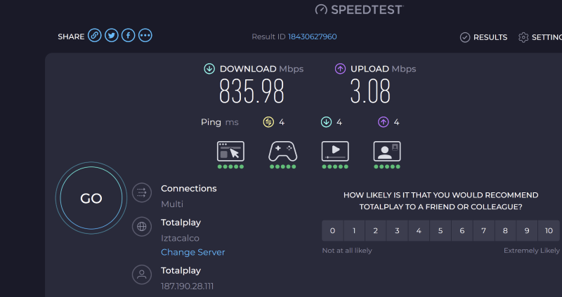
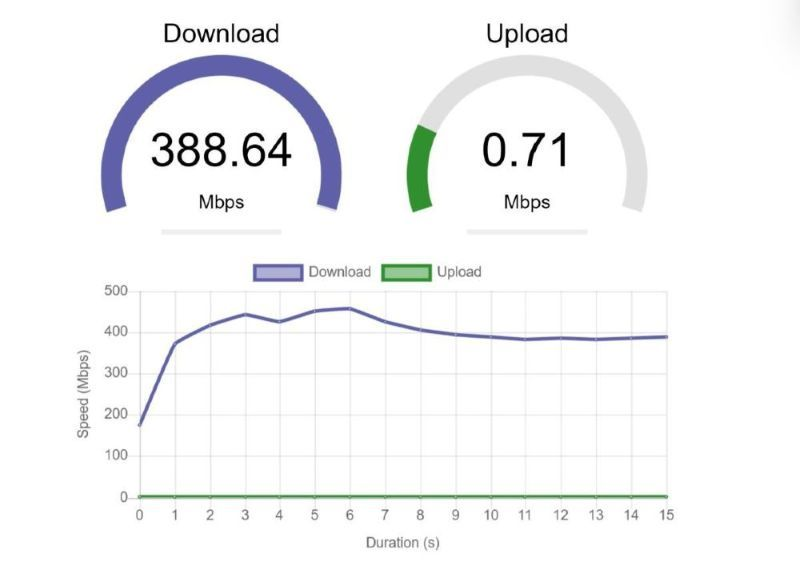
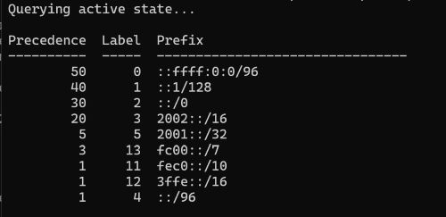

## The Problem

I recently had a big problem with my **Digital Nomad VPN Internet Service** at home in Cuernavaca, Mexico. My ISP, Totalplay, rolled out their IPv6 migration—and suddenly my speeds were all over the place.  

Running SpeedTest.net checks against their servers and others in Mexico City gave me surprising results.  

There was NOTHING wrong with the upload speed here! (sarcasm)  
  
  

Suspicious, I tried a server outside their domain.  
  

Hmm, speed was normal there. Back to Totalplay’s server:  
  
  

Clearly, something was wrong.  

---

## ISP Response (or Lack Thereof)

I contacted Totalplay, but they brushed me off. As long as my upload speed looked fine, they didn’t consider it a problem. That didn’t sit well with me. I ran more tests to confirm I wasn’t imagining things.  

  

Nope—I was right. The issue was tied to their **IPv6 implementation**.  

---

## IPv4 vs IPv6 Testing

I found a tool that let me run speedtests against the same server using IPv4 and IPv6 separately.  

  
  

The difference was obvious: IPv6 was the culprit.  

---

## Digging Deeper: Microsoft’s Guidance

Totalplay’s techs promised a callback but never followed through. So I dug into Microsoft’s documentation: *Guidance for configuring IPv6 in Windows for advanced users*.  

It explained how to use a registry key to configure IPv6 behavior, and more importantly, how to **prefer IPv4 over IPv6** without disabling IPv6 entirely.  

> Location: `HKEY_LOCAL_MACHINE\SYSTEM\CurrentControlSet\Services\Tcpip6\Parameters`  
> Name: `DisabledComponents`  
> Type: `REG_DWORD`  
> Value: `32` (decimal) or `0x20` (hex) → Prefer IPv4 over IPv6  

To confirm IPv4 preference:  
- Run `ping bing.com` → should return an IPv4 address.  
- Run `netsh interface ipv6 show prefixpolicies` → check precedence values.  
- Ensure `::ffff:0:0/96` has higher precedence than `::/0`.  

  

---

## The Fix

I applied the registry tweak, rebooted, and reran my speedtests. The improvement was immediate.  

But even with that fix, my IPTV boxes kept disconnecting under IPv6. Frustrated, I switched providers—from Totalplay to Telmex. Since then, no problems.  

---

## Results Today

Here’s what I’m seeing now:  
  

I can live with that!  

---

## ✨ Did You Know? IPv6 Troubleshooting Insights

- 🌐 **IPv6 vs IPv4** – IPv6 is designed to replace IPv4, but many ISPs still struggle with stable implementations.  
- 🛠️ **Prefer, Don’t Disable** – Microsoft recommends preferring IPv4 over IPv6 instead of disabling IPv6 entirely, since some apps rely on it.  
- 📡 **ISP Servers** – Speedtest results can vary dramatically depending on whether you test inside or outside your ISP’s domain.  
- 🔄 **VPN Complications** – VPNs often expose IPv6 leaks if not configured properly, leading to speed or security issues.  
- 💡 **Registry Tweaks** – Adjusting prefix policies is a safe way to control protocol preference without breaking compatibility.  

---

## Reflection

This experience reinforced a lesson: **don’t rely on your ISP to fix everything**. When IPv6 caused chaos, Totalplay dismissed the issue. By digging into documentation and making system tweaks, I solved the problem myself.  

For digital nomads and remote workers, stable networking is critical. Sometimes the fix isn’t switching hardware—it’s knowing how to configure your system. And when the ISP still fails, switching providers may be the only real solution.
