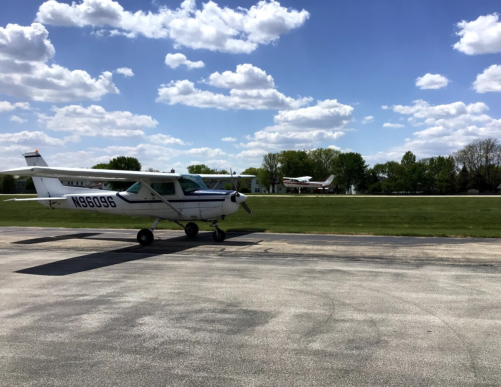
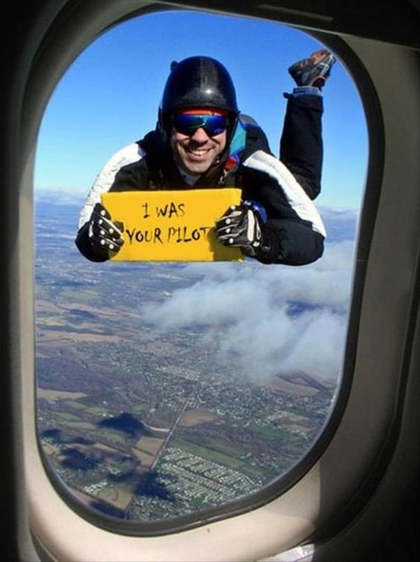

## Welcome to my site!##

This site is where I share aviation stories, practical tech tips, living in Mexico part-time, and lessons from digital nomading.  Yes, there is a lot of different topics here but I am trying to find out what content is something people want to read about and go from there.  If things take off on one side of the blog or another, I will spin off a separate site for that information.

I learned to fly while I was in my Junior and Senior years of High School.  I was at a boarding military school in Virginia, and they offered a flight program.  I remember my first solo quite vividly despite it being so many years ago.  Below is a picture of the actual plane I flew on my first solo.  
  

---

## Content of the Week

[Browse weekly posts.  These are the stories/videos/content I have found interesting in the proceeding week.→](/content-of-the-week/)

---

## Tech Tools I Use

[These are the tech tools I use when I work on my and other people's computers. →](/tools-i-use/)

---

## About

[Learn more information about me and how I got into computers back in the days when I had to ride a dinosaur to school.  Yeah, people tend to see me as someone that old in the IT field of today. →](/about/)
---
 

After having to stop flying due to a medical issue, I pivoted into IT because it is something I grew up with as a kid.  My first technical certification was for a **PowerBook** laptop in 1994.  I earned my CompTIA A+ certification in 1999 and my first Dell certification later that year.  I kept on learning and allowed IT to completely consume me.  It became my hobby and my career.  Whenever I could attend a training course, I went.  I got as many certifications as I could while someone else was willing to pay for them.  

Over the years, I earned many other certifications, and my final position before retirement was as a **Level 3 technician** at Los Alamos National Laboratory (LANL), supporting Linux, Mac, and Windows systems on both the Yellow (unclassified) and Red (classified) networks.  

I was part of the Distinguished Performance Award–winning Project AngelFire team while working at LANL.  I also was selected for many other Special Projects that required me to do work outside of my normal work duties.  

I went back to school after leaving LANL.  I have earned an associate, bachelor, and 3 master degrees since then.  I have also moved to Mexico where I help people become "Digital Nomads" by consulting with them on how to set up things to be successful down here.  I have been saying that I would create a blog site for quite some time but never really followed through with it.  I have about 800 MS Word documents sitting on my hard drive with stories I was going to put on my website if I ever created one.  Now I have to follow through with it.  

My content will be broken down into Digital Nomad - where I talk about things that are needed to be a Digital Nomad.  Tech Tips will be things I found interesting enough to write about about tech, Aviation where I talk about aviation themes and stories, Living in Mexico where I will talk about what it is like to live in Mexico and the things that go with it, and a Misc section where things are posted that don't fall into the other categories.  I will also be doing a "Content of the Week" post where I list things I find interesting enough to share and my "take" on the stories.

---

I want to give special thanks to the friends who helped me get this site running after so long.  

These are the people who pushed me to finally get this going.  

We also got to see each other at a recent event in the Washington, D.C. area — GL.iNet’s 15th Anniversary Conference.  
I jokingly referred to us as *“The Four Horsemen of the Apocalypse”* when we were together — purely in jest, as a playful nickname for our group.  

| | |
|---|---|
|***Special thanks to:***|These are the folks who pushed me to actually get a website up on the web and not just in my head.|
|**Adam**| https://thewirednomad.com|
|**Wicked Yoda**| https://www.wickedyoda.com|
|**Zippyy**| https://techrelay.xyz/|
|&nbsp;|&nbsp;|   <!-- extra spacing row -->
|***Daily***||
|**NASCompares**| https://nascompares.com/|
|**TorrentFreak**| https://torrentfreak.com/|
|**How-to Geek**| https://www.howtogeek.com/|  
|&nbsp;|&nbsp;|   <!-- extra spacing row -->
|***Regularly visited***|Sites I visit at least 3 or 4 times a week|
|**GamersNexus**| https://gamersnexus.net/|
|**Make Use Of**| https://www.makeuseof.com/|
|**HowtoForge**| https://www.howtoforge.com/|
|**Normal Guy Supercar**| https://www.youtube.com/@normalguysupercar |

---

Most of my VPN setups use GL.iNet equipment for a simple reason: GL.iNet’s equipment makes these setups quite easy to do.  

How much do I like their equipment?  

I have over 20 of their devices in use or on the shelf as backups.

Oh, and I learned to sky dive when I learned to fly.  Why?  I wanted to be able to get out of there safely if that airplane decided it didn't fly.  If you ever see this outside your window, you are in a BAD place to be.  ;)  

