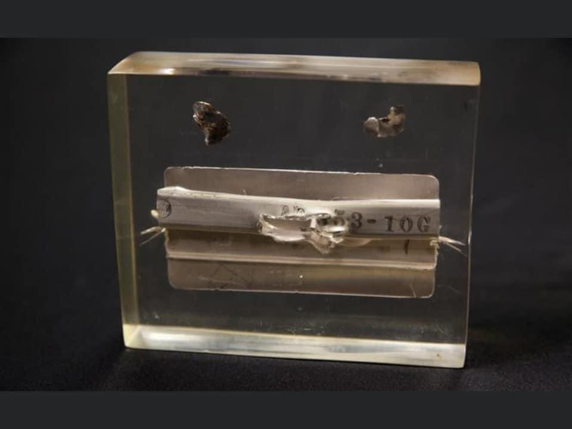

# ✈️ Blackbird Family Comparison: A-12, YF-12, and SR-71

The Blackbird family represents one of the most remarkable lineages in aviation history. Born from Lockheed’s Skunk Works during the height of the Cold War, these aircraft pushed the limits of speed, altitude, and stealth. The **A‑12**, **YF‑12**, and **SR‑71** were closely related in design but served very different missions: clandestine CIA reconnaissance, high‑speed interception, and long‑range USAF strategic reconnaissance. Together, they showcase how a single airframe concept evolved into multiple specialized roles — each breaking records and shaping aerospace engineering for decades to come.  

Lockheed’s Skunk Works developed this family of high-speed reconnaissance and interceptor aircraft in the 1960s.  
The **A‑12**, **YF‑12**, and **SR‑71 Blackbird** share a common lineage but differ in mission, configuration, and performance.  

---

# A‑12  

The A‑12 was the clandestine forerunner of the SR‑71 Blackbird. The airframes were nearly identical in shape and dimensions, but the A‑12 flew higher and faster than its sibling. Its existence remained classified for over 20 years, which is why its performance records were not widely known until much later.  

## ***Top Secret Oxcart → Declassified***

- The A‑12 could reach **Mach 3.29 (2,171 mph / 3,494 km/h)** and an altitude of **96,250 ft (29,337 m)** — higher than any other manned jet of its era.  
- All A‑12s were owned by the CIA and flown by 11 “sheep‑dipped” former USAF pilots (stripped of military identity for covert operations).  
- In total, 18 pilots (CIA and Lockheed test crews) flew nearly **2,900 flights** and logged over **5,000 hours**.  
- 29 operational missions were conducted over North Vietnam, North Korea, and Laos/Cambodia between May 1967 and May 1968.  
- By 1968, the USAF took over reconnaissance duties with the SR‑71, and the A‑12 fleet was placed into long‑term storage.  

---

# YF‑12  

The YF‑12 was a Mach 3+, high‑altitude interceptor prototype developed from the A‑12 airframe. It was intended as a replacement for the F‑106 Delta Dart.  

- Equipped with the **Hughes AN/ASG‑18 fire‑control radar** and capable of carrying **AIM‑47 Falcon air‑to‑air missiles**, it was the most advanced interceptor of its time.  
- Despite successful trials, funding was cut due to the Vietnam War and shifting military priorities.  
- According to Ben Rich’s *Skunk Works*, the YF‑12 was also politically disadvantaged: adopting it would have reduced the number of aircraft needed to defend North America, which some generals opposed because it meant smaller commands.  

---

# SR‑71  

  

The SR‑71 Blackbird was a two‑seat, long‑range, high‑altitude Mach 3+ strategic reconnaissance aircraft. Developed in the 1960s as a “black project” by Skunk Works, it pioneered stealth technology with a reduced radar cross section.  

- Capable of **Mach 3.2 at 85,000 ft**, the SR‑71 relied on speed as its defense. If a SAM was fired, the standard countermeasure was simply to accelerate and change heading slightly.  
- To illustrate its speed: an SR‑71 flew at **3,200 feet per second**, faster than the muzzle velocity of a .30‑06 rifle bullet (2,800–3,000 fps). Truly faster than a speeding bullet.  
- Flying the SR‑71 was challenging. At such speeds, even small navigation errors had huge consequences. One malfunctioning navigation system once left a crew nearly overshooting Los Angeles and crossing into Tijuana, Mexico.  

---

## 📐 Dimensions

| Aircraft | Length | Wingspan | Height |
|----------|--------|----------|--------|
| **A‑12** | ~102 ft (31.1 m) | 55.6 ft (16.9 m) | 18.5 ft (5.6 m) |
| **YF‑12** | ~101.6 ft (31 m) | 55.7 ft (17 m) | 18.5 ft (5.6 m) |
| **SR‑71** | ~107.4 ft (32.7 m) | 55.7 ft (17 m) | 18.5 ft (5.6 m) |

---

## ⚡ Performance

| Aircraft | Max Speed | Service Ceiling | Range |
|----------|-----------|-----------------|-------|
| **A‑12** | Mach 3.2+ | 90,000 ft (27,400 m) | ~2,900 miles (4,670 km) |
| **YF‑12** | Mach 3.35 (test trials) | 80,000+ ft (24,400 m) | ~2,000 miles (3,220 km) |
| **SR‑71** | Mach 3.3 | 85,000 ft (25,900 m) | ~2,900 miles (4,670 km) |

---

## 🔑 Distinctions

- **A‑12 Oxcart**  
  - Single‑seat CIA reconnaissance aircraft.  
  - First titanium‑intensive airframe.  
  - Faster and higher‑flying than the SR‑71, but carried less fuel and payload.  

- **YF‑12**  
  - Interceptor variant with radar and missiles.  
  - Tested successfully but never funded for full service.  
  - Slightly heavier due to weapons systems.  

- **SR‑71 Blackbird**  
  - Two‑seat USAF reconnaissance aircraft.  
  - Larger fuselage for sensors and fuel.  
  - Longest operational service, retired in 1998.  

---

## 🏆 Summary

- **Fastest**: YF‑12 (test speeds Mach 3.35).  
- **Highest flying**: A‑12 (96,250 ft).  
- **Most enduring**: SR‑71 (over 30 years of service).  

Together, these aircraft represent the pinnacle of Cold War aerospace engineering, balancing speed, altitude, and mission specialization.

---

## ✨ Did You Know? Blackbird Family Quirks

- 🛢️ **Fuel Leaks Were Common**  
  Like the SR‑71, the A‑12 leaked fuel on the ground until its titanium skin expanded at speed.  

- 👩‍🚀 **Pilots Were “Sheep‑Dipped”**  
  CIA A‑12 pilots were stripped of military identity to maintain deniability if captured.  

- 🔥 **Interceptor That Never Was**  
  The YF‑12 proved capable of Mach 3+ interception, but politics and budgets killed the program.  

- 📡 **Stealth Before Stealth**  
  The SR‑71’s chines and radar‑absorbing composites made it the first operational stealth aircraft.  

- 🏛️ **Museum Rarities**  
  Only a handful of A‑12s survive today, and the only place to see an A‑12 and SR‑71 side‑by‑side is Blackbird Airpark in Palmdale, CA.  

---

## Personal Encounters

I’ve been lucky enough to travel the southwest United States and see several Blackbirds in person.  

  
The California Science Center’s A‑12 is the only A‑12 trainer. It flew more missions and logged more hours than any other A‑12.  

  
This photo was taken through the fence at Blackbird Airpark in Palmdale, CA during my April 2012 “Chasing Blackbirds” trip with my son. It’s the only place in the world where you can see an SR‑71 and A‑12 side‑by‑side. *Hint: the SR‑71 has two sets of windows, while the A‑12 has only one.*  

---

## 🪂 Closing Reflection

The Blackbird family was more than a set of experimental aircraft — it was a bold statement of Cold War ingenuity. Each design pushed the boundaries of what was possible, from the A‑12’s secret missions to the YF‑12’s interceptor trials and the SR‑71’s unmatched reconnaissance record. Together, they remain icons of aerospace engineering, reminders of an era when speed, altitude, and secrecy defined the cutting edge of aviation.
