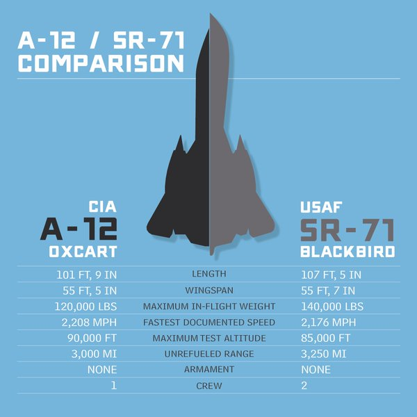

# ✈️ Blackbird Family Comparison: A-12, YF-12, and SR-71

Lockheed’s Skunk Works developed a family of high-speed reconnaissance and interceptor aircraft in the 1960s.  
The **A‑12**, **YF‑12**, and **SR‑71 Blackbird** share a common lineage but differ in mission, configuration, and performance.  

# A-12  
  
  

The A-12 was the clandestine forerunner of the SR-71 Blackbird.  The airframes are nearly the same shape and have similar dimensions.  While the SR-71 holds many records for a manned jet aircraft, the A-12 wflew higher and faster than the its sibling because its existence was classified for over 20 years.  

## ~~***Top Secret Oxcart***~~  

## ***Declassified***  

The A-12 was able to reach Mach 3.29/2,171 mph (3,494 kph) and an altitude of 96,250 ft (29,337m).  

## ~~***Top Secret Oxcart***~~  

All A-12s were owned by the CIA and flown by 11 "sheep dipped" former USAF pilots.  There were a total of 18 A-12 pilots between the CIA and Lockheed test pilots.  They flew nearly 2,900 flights and more than 5,000 hours.  29 were operational missions over North Vietnam, North Korea, and Laos/Cambodia between May 31, 1967 and May 8, 1968.  These missions were taken over by the USAF in 1968 using their SR-71 in the A-12's place.  The 7 A-12s were put into non-flyable storage for over 20 years.

# YF-12  

The YF-12 was a Mach 3+, high-altitude interceptor prototype.  It was developed in the late 1950s and early 1960s as a potential preplacement for the F-106 Delta Dart.  It was based off the A-12.  It used the Hughes AN/ASG-18 fire-control radar and could be armed with AIM-47 Falcon air-to-air missiles.  The funding that would have been used to put it into operating use was due to the Vietnam war and other military priorities.  According to Ben Rich's *Shunk Works*, the YF-12 was not funded because there would have been a need for fewer aircraft to defend the North American continent and American generals didn't want to have smaller commands as a result of this.  

  

# SR-71

The SR-71 Blackbird was a two seat,long-range, high-altitude Mach 3+ strategic reconnaissance plane.  It was developed in the 1960s as a "black project" by the Lockheed Skunk Works.  It was a pioneer in stealth technology with its reduced radar cross section.  It was able to fly missions at Mach 3.2 and 85,000 feet.  Its defensive countermeasures were simple - if a SAM was fired at it, it just sped up and maybe did a slight change of heading.  Just how fast is it?  Well, a SR-71 flies at 3,200 feet per second.  That is faster than a 30.06 bullet's muzzle velocity is 2800 to 3000 feet per second.  Yes, it was faster than a speeding bullet!  

Flying the SR-71 was not easy.  The level of speed made it difficult to control and a missed turning point could have significant impact on its flight path.  I remember reading when a Blackbird had a navigation system malfunction that the crew decided to try doing without, they could end up turning late by a few moments and end up over Tijuana, Mexico instead of Los Angeles.  That is just how fast this plane flew!

  

---

## 📐 Dimensions

| Aircraft | Length | Wingspan | Height |
|----------|--------|----------|--------|
| **A‑12** | ~102 ft (31.1 m) | 55.6 ft (16.9 m) | 18.5 ft (5.6 m) |
| **YF‑12** | ~101.6 ft (31 m) | 55.7 ft (17 m) | 18.5 ft (5.6 m) |
| **SR‑71** | ~107.4 ft (32.7 m) | 55.7 ft (17 m) | 18.5 ft (5.6 m) |

---

## ⚡ Performance

| Aircraft | Max Speed | Service Ceiling | Range |
|----------|-----------|-----------------|-------|
| **A‑12** | Mach 3.2+ | 90,000 ft (27,400 m) | ~2,900 miles (4,670 km) |
| **YF‑12** | Mach 3.35 (interceptor trials) | 80,000+ ft (24,400 m) | ~2,000 miles (3,220 km) |
| **SR‑71** | Mach 3.3 | 85,000 ft (25,900 m) | ~2,900 miles (4,670 km) |

---

## 🔑 Distinctions

- **A‑12 Oxcart**:  
  - Single-seat CIA reconnaissance aircraft.  
  - First titanium-intensive airframe.  
  - Faster than the SR‑71 but carried less fuel and payload.  

- **YF‑12**:  
  - Interceptor variant with radar and air-to-air missiles.  
  - Tested by USAF but never entered full service.  
  - Slightly heavier due to weapons systems.  

- **SR‑71 Blackbird**:  
  - Two-seat USAF reconnaissance aircraft.  
  - Larger fuselage for sensors and fuel.  
  - Longest operational service, retired in 1998.  

---

## 🏆 Summary

- **Fastest**: YF‑12 (test speeds Mach 3.35).  
- **Highest flying**: A‑12 (90,000 ft).  
- **Most enduring**: SR‑71 (over 30 years of service).  

Together, these aircraft represent the pinnacle of Cold War aerospace engineering, balancing speed, altitude, and mission specialization.

---

I have been lucky enough to have traveled the southwest United States and have seen quite a few Blackbirds over the years.  Here are 2 pictures I have taken during those visits.

The California Science Center's A-12 is actually the only A-12 trainer.  It flew more than any other A-12 in number of flights and total flight time.  

This photo was taken through the fence at Blackbird Airpark in Palmdale, CA during my April 2012 "Chasing Blackbirds" trip for my son's spring break.  This is the only place in the world where you can see a SR-71 and A-12 side-by-side.  Which one is which in the photo?  HINT: the SR-71 has 2 sets of windows on the side whereas the A-12 had a single set.  
