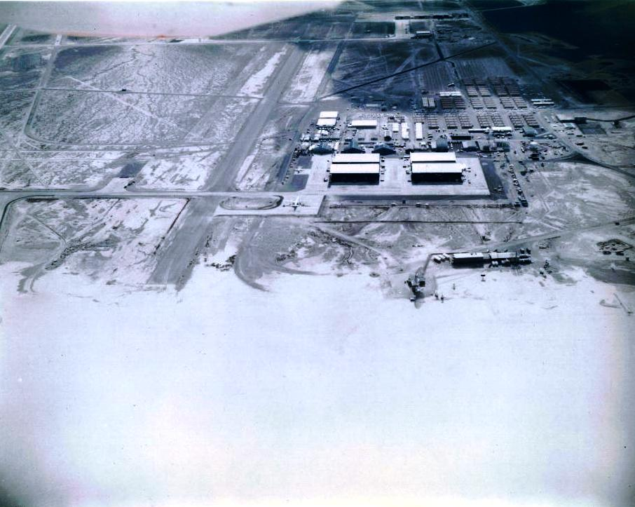
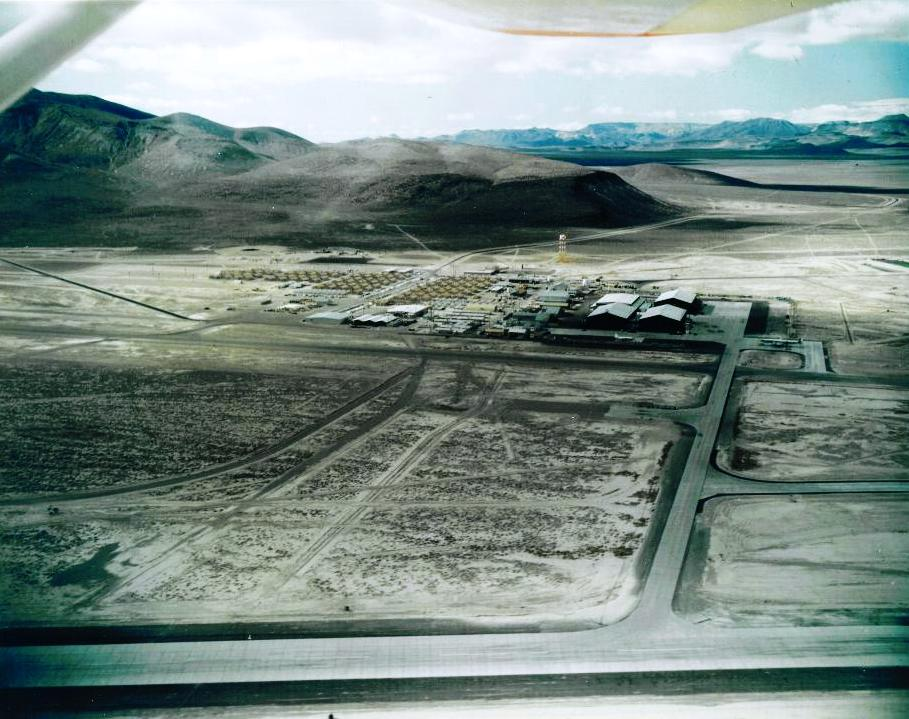
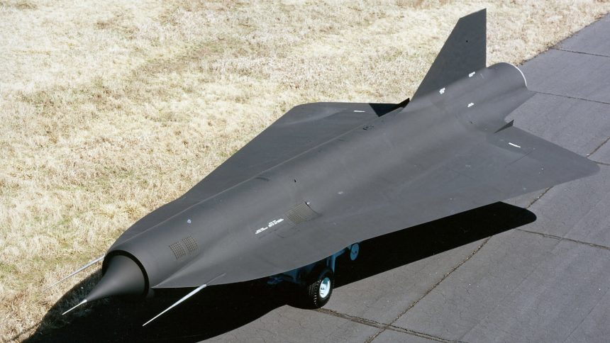
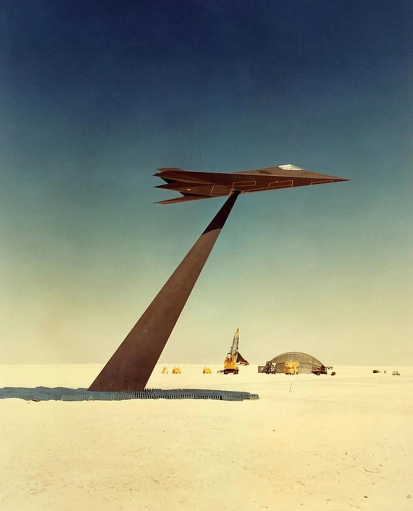
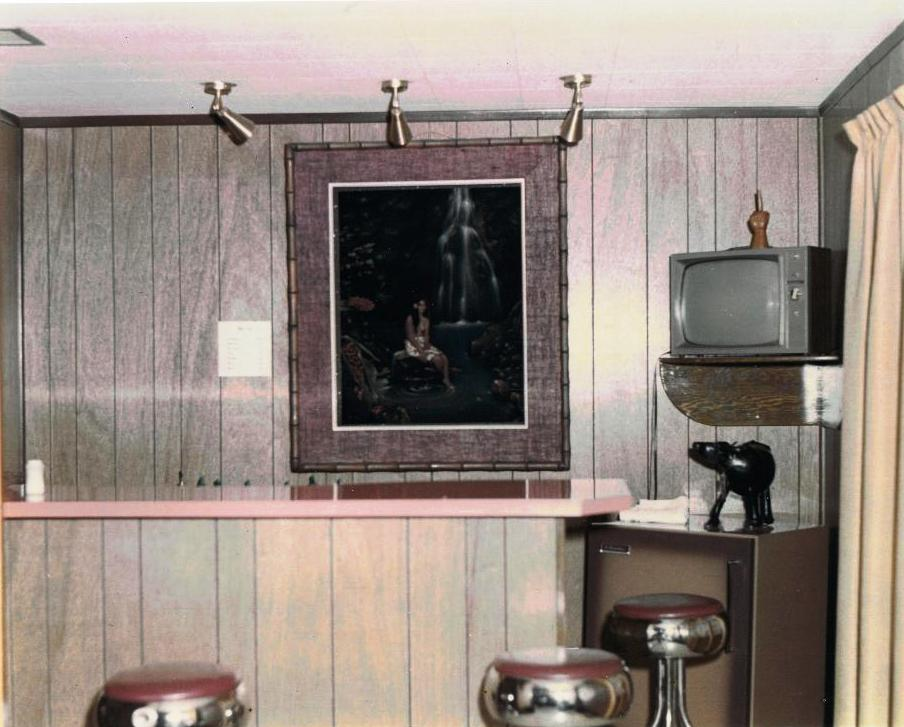
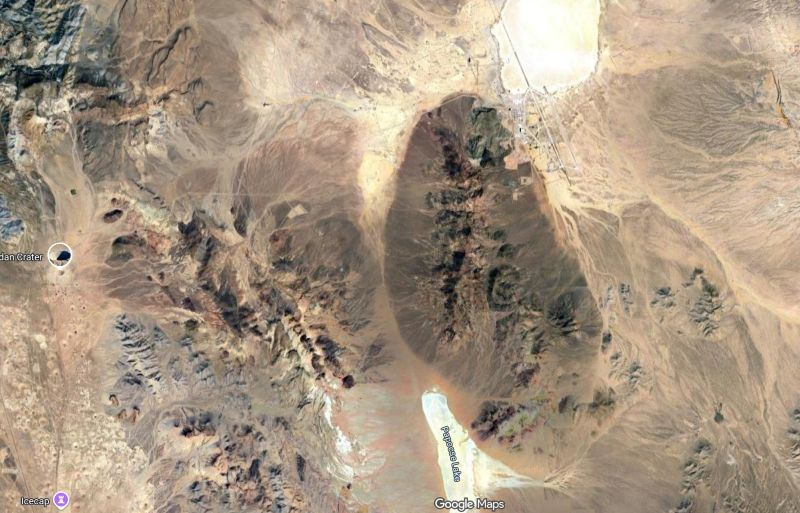

***NELLIS BOMBING AND GUNNERY RANGE***  
***RESTRICTED AREA***  
***NO TRESPASSING BEYOND THIS POINT***  
***PHOTOGRAPHY IS PROHIBITED***

This was the sign I read from the bus as I entered the restricted area. I was traveling for a special project with a U.S. Department of Energy Nuclear Weapons Laboratory. Am I some brilliant scientist or aviation expert entering this area? No. I was simply a computer "geek" with a knack for fixing systems quickly, and management selected me for this assignment.  

I cannot talk about ***REDACTED***, but I can say I completed the project. To follow security rules to the letter, I must remain vague. What I can share is that I was headed to Groom Lake — better known as Area 51. At that time, the U.S. Government did not officially acknowledge its existence. I was about to cross into the realm of Top Secret.

---

## 🛡️ Security and Classification
Classification rules are straightforward: you don’t talk about your work. It isn’t a secret that you hold a clearance, but the details remain off-limits. At the time of this trip, I had a **Top Secret clearance with SAP and SCI endorsements**, plus a DOE Q clearance with all Sigma endorsements.  

My work was in computers — everything from desktops and peripherals to wall plates. Duties were separated: I wasn’t supposed to handle networking, but I knew enough to be trusted with it, which is why I ended up here.  

I spent two weeks at Area 51. My world was limited to one hangar, the chow hall, and the building where I slept, always escorted. The rules were rigid, but the experience was fascinating. One escort shared with me the aviation history of the base — and that history is nothing short of extraordinary.

---

## ✈️ Aircraft Tested at Area 51
Aircraft publicly known to have been based at or tested in Area 51 include some of the most legendary machines in aviation history:

| Aircraft | Era | Purpose | Notes |
|----------|-----|---------|-------|
| **Lockheed U-2** | 1950s | High-altitude reconnaissance | First major project at Area 51; designed to spy on Soviet activity |
| **Lockheed A-12 Oxcart** | 1960s | Predecessor to SR-71 | Ultra-fast reconnaissance aircraft; tested extensively at Area 51 |
| **SR-71 Blackbird** | 1960s–70s | Strategic reconnaissance | Famous for speed/altitude records; refined from A-12 |
| **F-117 Nighthawk** | 1980s | Stealth attack aircraft | First operational stealth fighter; developed under “Have Blue” program |
| **Have Blue prototypes** | 1970s | Stealth technology demonstrators | Experimental aircraft proving stealth concepts before F-117 |
| **Tacit Blue** | 1980s | Battlefield surveillance | Nicknamed “Whale”; tested radar-evading designs |
| **Captured MiG fighters** | Cold War era | Evaluation of Soviet aircraft | MiG-17, MiG-21, and others tested under “Have Doughnut” and “Have Drill” programs |
| **Unmanned aerial vehicles (UAVs)** | 1990s–present | Reconnaissance & strike | Includes drones like the RQ-170 Sentinel, reportedly tested at Area 51 |
| **Modern stealth prototypes** | 2000s–present | Classified projects | Believed to include next-gen stealth bombers and hypersonic aircraft |

---

## 📸 Groom Lake in Photos
Photos of Groom Lake (Area 51) from the late 1960s and early 1970s:  
  

### A-12 Oxcart and D-21 Drone
  
  

The A-12 wasn’t just flown here — its radar cross section was tested by mounting it upside down on two battleship drive shafts welded together.  

The D-21 drone was also tested. A specially modified A-12 (the M-21 variant) acted as the “mothership” for the unmanned D-21.  
  

### F-117 Stealth Testing
The F-117 was based at Groom Lake for much of its active life. Its stealth was so effective that during radar cross section testing, the pole it sat on reflected more radar than the aircraft itself. Engineers had to design a special pylon just to measure it. The F-117 had the radar cross section of a hawk’s eyeball.  

---

## 🏠 Life at Groom Lake
Housing for pilots in the 1960s was spartan:  
  

---

## ☢️ The Nevada Test Site
On the other side of the mountain range lies another secret site: the U.S. Department of Energy’s **Nevada Test Site (NTS)**, where the majority of America’s nuclear weapons tests took place.  

Roads connect the two facilities, but they are dirt tracks best suited for 4x4 vehicles.  

Here’s a satellite view showing just how close these two top-secret locations are:  

I remember my first time at NTS. I was part of a team from a National Laboratory on a project I cannot discuss. But we were given a tour of the facility and saw the famous craters. The **Sedan Crater**, for example, was the result of the Plowshare test — essentially, “let’s see how big a hole we can make.”

---

## 🔎 Reflection
It is remarkable how much secrecy was hidden in the deserts and mountains of Nevada. Two of the most secretive bases in U.S. history — Area 51 and the Nevada Test Site — sit side by side, yet operated separately. Few people have visited both. I am one of the few.

---

## 📜 Epilogue
For decades, the U.S. Government denied the existence of Area 51. Many knew about it, but official acknowledgment came much later. Before that admission, I visited the Stafford Air & Space Museum in Weatherford, Oklahoma. On display was a MiG fighter. The placard noted that this MiG had been flown at Groom Lake while General Stafford was base commander.  

The irony was striking: at the time of my visit, both the base and **Project Constant Peg** — the U.S. Air Force program that operated Warsaw Pact aircraft like the MiG-17, MiG-21, and MiG-23 — were still classified.  

There’s a saying that over 80% of classified information eventually shows up in the media. My experience at the museum was a perfect example of that truth.
