# Top Secret - Unauthorized personnel will be shot if they continue to read this post.....

Okay, you have made the decision.  You want to take a chance with your job and work from somewhere that you are not authorized.  You now need to set things up so that you can make it the least likely to get caught.  You agree not to hold me responsible for any outcome you have if you are caught doing what I am about to show you how to do.  

First things first, you have to talk about the prerequisite requirements before you attempt to set this up.  I will be using GL.iNet devices for this setup because it is the most "friendly" way to do this.  If you are stupid about tech and don't know what you are doing, this is the best way to follow this.  It DOES take some skills to set up BUT this guide is going to help you set it up and make it as easy as possible to do so.

1. You should buy 2 GL.iNet routers.  I recommend buying 1 rull router and 1 travel router.  Those will be discussed later.  
2. We will be using WireGuard as the VPN technology.  There are other ways to do this but I will not be discussing those in this post.  I might do a future post about this later on.
3. If you are not using the GL.iNet routers on both sides, this post isn't for you.  I am trying to do this in a KISS manner - keep it simple stupid.  I want this post to be as non-technical as possible so the majority of people can follow the set up.
4. I will be using a GL.iNet Beryl AX to show you how to set up both the VPN server and client.  Screens might be slightly different for you but you should be able to figure it out.  If not, I suggest the GL.iNet Reddit to ask for help.  https://www.reddit.com/r/GlInet/
5. From now on, I will refer the VPN server as the "HOME" system.  The VPN client - which you will take with you on your travels - will be called the VPN client.  I will also refer them to "server" and "client".  Just remember that the "server" is where you want to pretend to be and that the "client" is where you actually are.
6. We will be using terms "LAN" and "WAN" shortly.  Just remember LAN = Local and WAN = World.  The LAN is for local things, and WAN is for the world at large.  
7. There is a step that I cannot help you with easily other than tell you that you need to go to another site and look up how to do it.  That step is called "port forwarding".  You need to look at the device that your ISP gave you and find the make/model# of it.  Once you do, go to YouTube.com and search for "make/model port forwarding" to find a video on how to do it.  You can also go to https://portforward.com/router.htm and see if they have a primer for you.  We are going to be leaving the port that needs to be forwarded to the default 51820 and it should be UDP, not TCP or TCP/UDP - UDP only.  I sometimes forget that critical issue myself.

# VPN server - where you want to pretend to be

Okay, you are ready to take the first step - you want to start to set up your VPN server.  Here, you will be taking the VPN server device out of the box (yes, that is a requirement), put that on the desk, and plug it in.  GL.iNet devices have a "universal" type power adapter that you will have to twist the plug type on the end.  Once you twist that on, plug that into the power strip, and the other side into the router itself.  Next, you need to take a network cable AKA CAT-5e AKA Ethernet AKA "telephone jack cable but bigger" and plug one end into the ISP modem/gateway/ONT and the other end into the WAN port on the router.  

Please look at this photo.  The WAN port is labeled "2.5G WAN".  The key is WAN here.  WAN = World.  You want to connect the world to your ISP's equipment and therefore the cable goes from WAN to their equipment.
Next, you will want to plug another CAT-5e (Ethernet/giant telephone jack cable) into your computer and the other end into the LAN port on the router.  
Once you have done this, you have the hardware set up.  Now you need to use your computer.

I will do this as a table so you can see what step you are at and what you should be seeing side by side.  
| | |
|---|---|
| 1. Open your web browser. ||
| 2. Enter this address at the top of your browser and hit enter. | |
| 3. You will see this screen where you need to set the password for the router.  Keep it simple so you can remember it in the future.  Once you have, click "Next" at the bottom. |  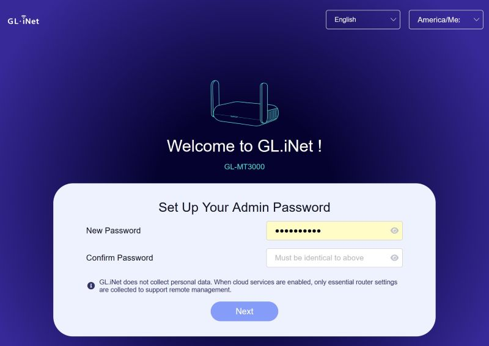|
| 4. You will see the "Set Up Wi-Fi screen next.  I would leave these at the defaults for now and come back to them later.  Click "Next" at the bottom of the screen. | |
| 5. After a few moments, you will be greated by this screen.  You can read about the various modes and such but in the end you will just click the blue "Exit" button on the top right. | 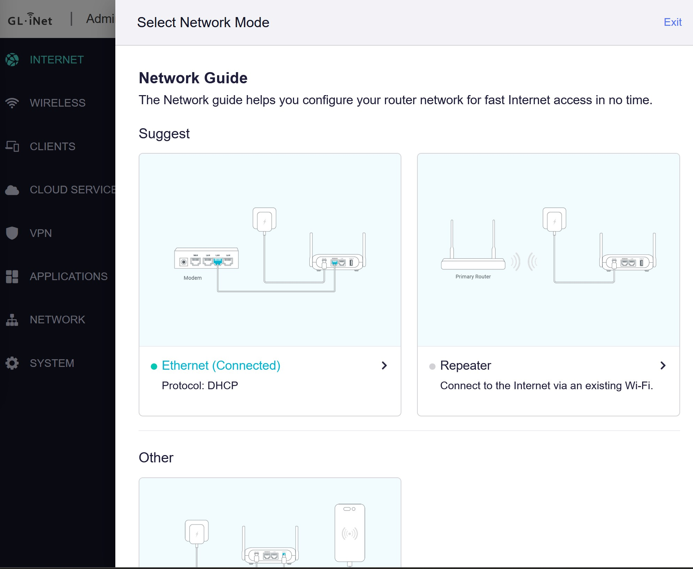|
| 6. You should be at this now: | 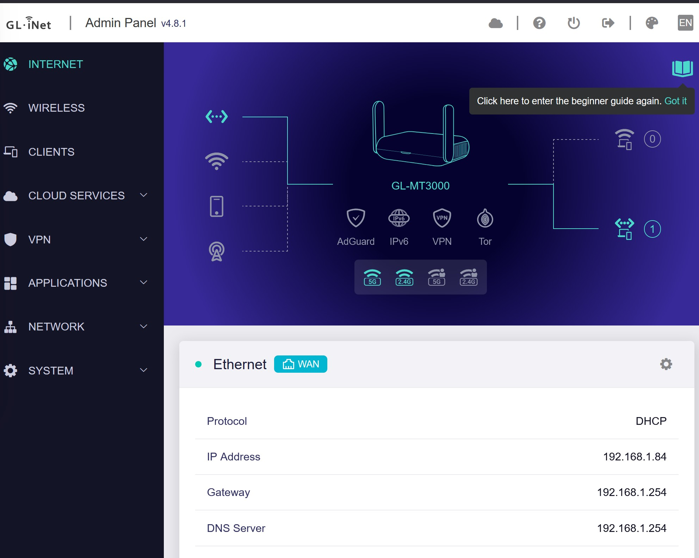|
| 7.  Do you see the selection called "Cloud Services" on the left side?  Click on it.  You should see this: | |
| 8. Click on "GoodCloud". It will bring you to this screen. | |
| 9. Click "Get Started".  If you do, it will come up with something about Cloud Service is currently disabled.  Click "Enable". | | 
| 10. It will have you create an account and/or login.  Do it.  Once you do, it should show something like this: | | 
| 11.  Click somewhere outside of that popup on the web browser's screen and you will be greeted by this: |  | 
| 12.  You will be clicking on the toggle switches for both "Enable Remote SSH" and "Enable Remote Web Access" and then click Apply.  | 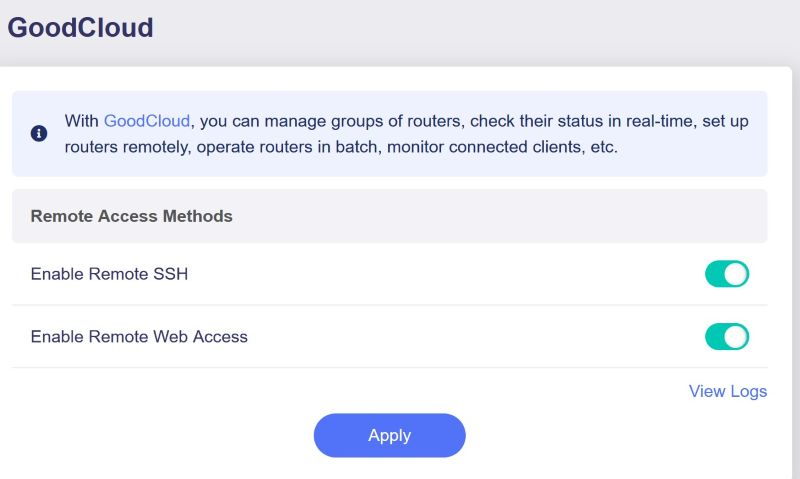|
| 13.  Oh, I forgot to tell you what GoodCloud is.  It is simple.  It is a service that allows you to access your various equipment via the web even if your VPN is not connect.  Why is that important?  If your VPN goes down for any reason, you can use a web browser on another piece of equipment to troubleshoot. | You don't want to have problems back home and have no way to fix it if you are someone on a beach.
| 14.  It is now time to setup the VPN server.  Click on VPN on the left side of the screen. It will bring up this dropdown. Select "WireGuard Server". | |
| 15. You will see this screen.  Click on "Generate Configuration". | 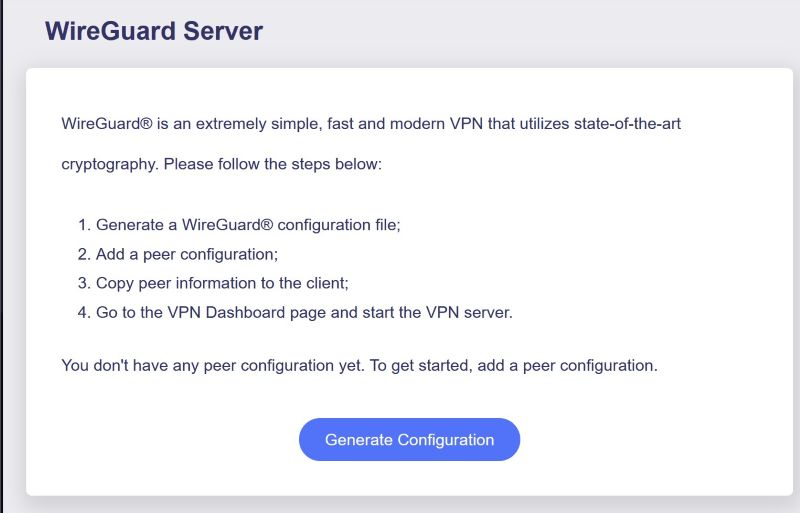|
| 16. You will see this screen.  Click on "Start".  | |
| 17.  Congratulations!  You have setup a WireGuard VPN server! You are not done yet but this is a milestone to be proud of! You still have some work to do but it is a milestone!  Be proud of yourself for a few seconds and then click on the "profiles" tab underneath the light blue window.| |
| 18.  You will see this screen.  Click on the blue "+ Add" button on the bottom right. | 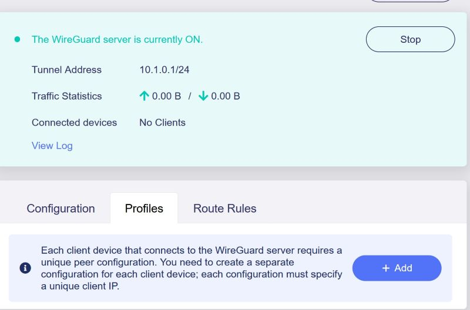|
| 19. Okay, now it is time to name your client connection.  You can call it "puff puff pass" or "On the beach" or something like that but I would keep it simple and name it something that you can consistentially remember about its location or some other thing that will be.  This naming convention will be something you will want to be able to figure out in the future when you are stoned, drunk, or both!  In this case, I am going to call it "client" just to make it easy to follow.  Don't be an idiot and call it "ICE Kidnap Team #3" or something like that because it might be hard to figure out in the future.  After naming it, hit "Apply" | 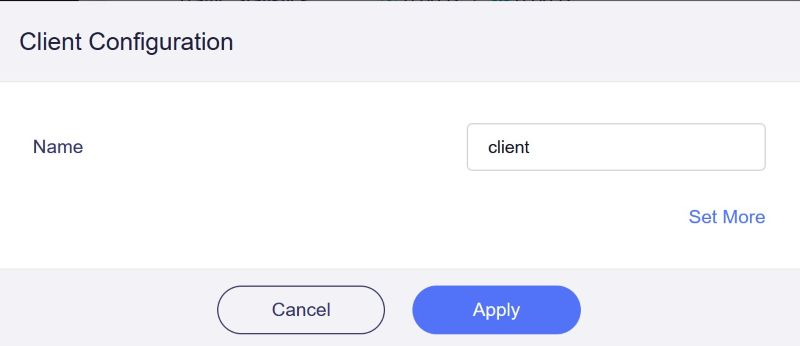|
| 20. You should see something like this.  Click "Download" at the bottom and save it to a place you can find.  I suggest you put it in a folder structure that you can easily find and know what in the hell it is.  I will save mine to the Downloads/VPN Profiles Directory that I created.  | 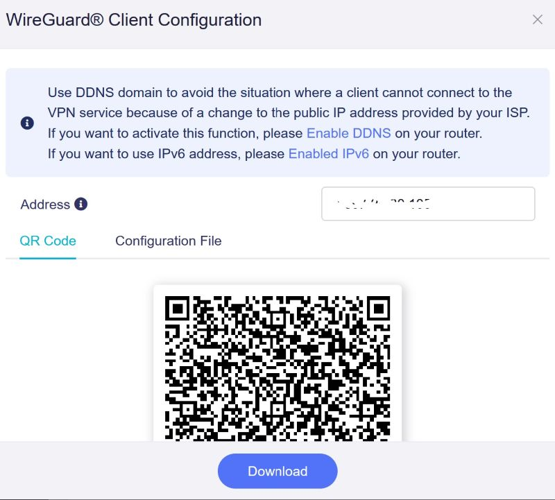
That's it!  You are done with setting up the Server!  Congratulations!

# VPN Client - the device that you take with you.

With the client, you are going to be following the same set of directions 1-13 as you did above.  Let's not remake the wheel here.  Just go up to the previous section of the server setup and do 1-13.  What?  You don't want to do that?  TOO BAD!  I am not going to duplicate all that stuff again!  Follow those directions and when you get to step 14, continue from there with these directions.
| | |
|---|---|
| 14.  Click on "WireGuard Client". | |
| 15. You will see this.  Scroll down until you see "+Add Manually".  Click on that. | 
| 16.  You will see this screen.  You will click on "Select a file to upload or drag it here".  | 
| 17. Navigate to the directory where you saved the config file in step 20 of the server.  Select it and click "open"| 
| 18. At this screen you will click "Apply" on the bottom. | 
| 19.  If all goes as it should, you should see something like this.  The "client" name will be replaced by whatever you called the VPN client's name in Step 20 of the server setup. | 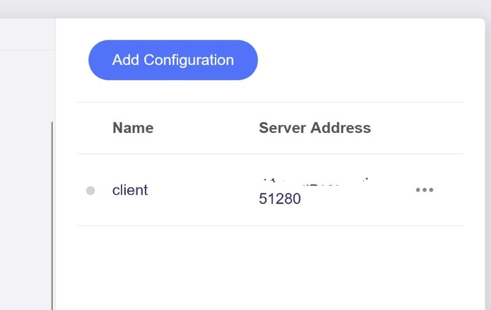
| 20.  Do you see the ... on the right side of the screen next to where it has a # combination that ends in :51280?  Click on them. You will see this. If you do, click "start". | 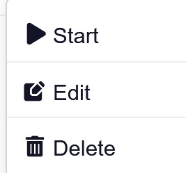
| 21. It will come back to this screen.  See the blue dot to the left of "client"?  That means it is connected.  It will start out at a yellow dot but change when it is connected.  That means that you did everything correct so far!  Congratulations!  Having said that, there is one VERY import part that still needs to be done. | 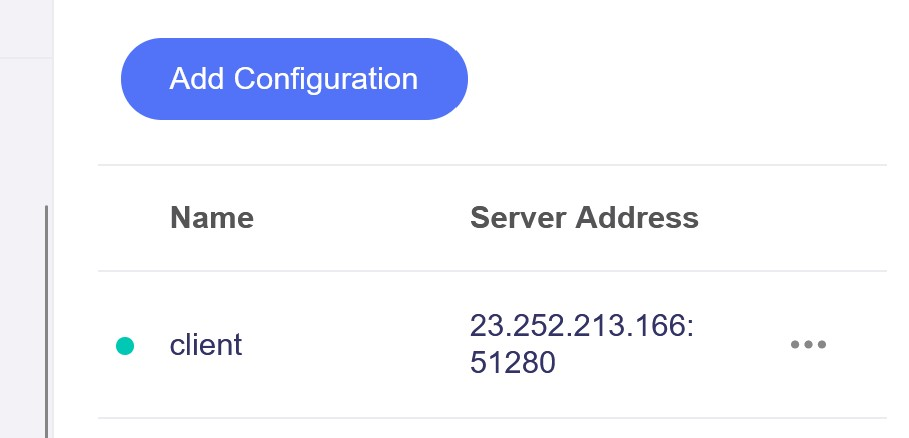
| 22.  On the left side of the screen you should see this:  Click on "VPN Dashboard".  | 
| 23.  This is the MOST important screen if you want to hide your location.  Do you see that toggle switch on the right side that  says "off"?  That is the on/off button for the kill switch.  | | 
| 24.   The "kill switch" makes it so that NO traffic will go from connected equipment to anywhere if the VPN connection drops.  Sure, you might be disconnected from a VoIP session or video call, whatever, but that means that you are being protected from your location being found.  It isn't foolproof but it is the best that is available.  MAKE SURE IT IS ON like it is on this picture. |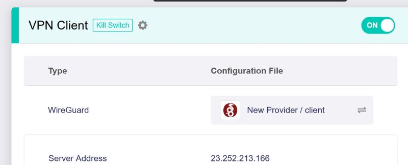|  

There you have it.  You have a VPN server and client now setup.  I will be doing a new post soon on how you can test the VPN setup but this is it for tonight.  I didn't sleep enough at work today to be able to stay awake long enough to do the rest tonight.

NOTE:  You are going to need to leave the server plugged into the power and connected to your ISP's equipment while gone.  You will also need to pay your ISP's bill while you are away.  It could be hooked up at a friend, relative, or parent's house but it needs to be connected somewhere.  I know, you might have to bribe someone to let you do it but hell, that is part of the fun!

NOTE 2:  You might want to be sure that whomever you are abusing...err...using for the VPN server should get as fast as an Internet package as possible at a reasonable cost.  Reasonable is whatever you think it is but it needs to be as quick as affordable.  You will also want to have them using either fiber or, if that is not possible, cable Internet service.  Speeds and latency are going to be critical for you going forward.  Fiber has the best speeds/latency usually.  Cable is the #2.  There are other ones out there but can open a huge can of worms that I don't want to deal with explaining tonight.