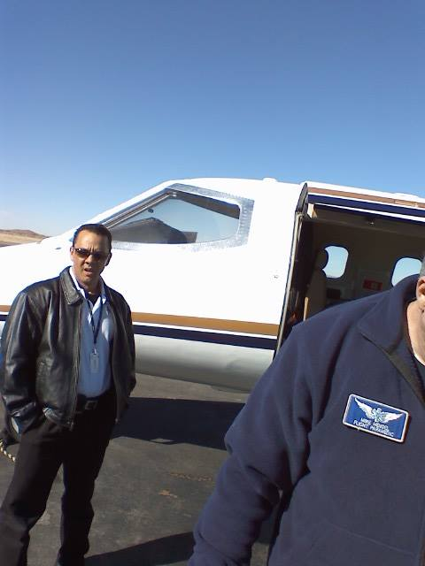

## Disaster, Day 2  

After my accident, it was clear I had nowhere practical to recover. I would be in a wheelchair for months, yet my home was a 50‑year‑old duplex with all the bathrooms upstairs and the kitchen downstairs. That setup was impossible. The decision was made: I would be flown to Las Cruces, NM, where I could undergo surgery and rehabilitation in a more suitable environment.  

Drugged‑up me, ever the private pilot and veteran OV‑1 Mohawk pilot from my Army days, thought: *“Cool, I’ll get flown down in a Cessna 182 or maybe a Cessna 337. I’ll even ask to take the controls for a bit since I’m licensed and familiar with the type.”*  
Reality check: nope. First, I couldn’t work the rudder; second, I was so drugged up they wouldn’t have let me near the controls even if I could.

---

### Aviation Aside: Los Alamos Airport  

Landing at Los Alamos is an experience in itself. Below is a photo from a Cessna 172 I flew into Los Alamos back in 1990.  

Do you see that strip on the center right that looks like an aircraft carrier? That’s Los Alamos airport, perched at 7,120 feet above sea level. You can only land on runway 27 and take off on 09. Winds can shift from two different directions at each end because the airport is surrounded by cliffs and canyons.  

There’s also a restricted area that forces those runway choices. Back then, you needed a special permit to fly in or out. Approaching the field, you had to radio:  
*“Los Alamos Unicom, this is ____. We are over ___ (one of two entry points to the pattern). Weather report. Permit #____.”*

---

### The Flight Surprise  

The next day, I was told I’d be taken by ambulance to the airport for my flight to Las Cruces. I expected Los Alamos airport, but the ambulance kept going. Groggy, I asked where we were headed. “Santa Fe,” they said. Okay, that made sense.  

At Santa Fe’s airport, the driver didn’t know the gate code. I called it out, but they didn’t understand until I repeated it several times. Finally, the gate opened and we pulled onto the field. I had flown in and out of Santa Fe so many times that I had the code memorized. I still wonder if they’ve changed it since.  

Waiting there was not a Cessna, but a **Learjet 45**. WHAT?! I was wheeled out on a stretcher, and the crew struggled to figure out how to transfer me into the aircraft. Finally, I suggested: “Help me sit up. I’ll stand on one leg like a flamingo, pivot, and sit down.” It worked. Picture this: me in a hospital gown, bare backside exposed, improvising solutions for the flight crew.  

We took off for Las Cruces. Drugged, half‑delirious, I played flamingo, cracked terrible jokes, and probably drove the crew crazy. By the time we landed 45 minutes later, I’m sure they were relieved to hand me off.

---

### Hospital Transfer Games  

Here’s something I learned about hospital logistics. When the Lab and LAMC tried to transfer me to MountainView Regional, the hospital refused, claiming no available beds. But hospitals must reserve a certain number of beds for ER patients. The workaround? The ambulance simply dropped me off at the ER. Problem solved.  

---

### Surgery and Dr. Yaw  

Once admitted in Las Cruces, the next few days blurred together. The surgeon originally scheduled was unavailable, so his partner, **Dr. Kenneth Yaw**, took over. You’ll see his name again.  

When Dr. Yaw visited my room, he seemed impressed that I could discuss my injury in detail. I even used the term “calcify” to describe how broken bones mend. He joked that I did better than most medical students. Whether true or not, it humanized him. At that moment, kindness mattered more than accuracy.  

The surgery went forward: 16 screws and 2 plates installed in my left ankle. Dr. Yaw warned me that if I broke it again, I could be crippled. He also cautioned I might never walk again. In hindsight, that was probably “doctor speak” to cover his bases, but it was sobering nonetheless.  

The day after surgery, I was transferred to the **Rehab Hospital of Southern New Mexico** to begin recovery.

---

### A Family Pattern  

Here’s an odd aside. In February 2007, my dad broke his ankle in Las Cruces, had surgery, and rehabbed at the same hospital. In February 2008, I broke mine and rehabbed there too. Then in February 2009, my dad slipped on wet tile getting out of the shower and broke his other ankle. Guess where he rehabbed? Yep, the same hospital.  

At that point, we joked about needing a “volume discount.” By 2010, we said the family should just live inside rubber balls every February.  

---

### Reflection  

Day 2 was surreal: from expecting a small Cessna to being loaded onto a Learjet, improvising transfers in a hospital gown, and learning how hospitals bend rules to accept patients. The surgery was serious, but the humor, human kindness, and family irony gave me perspective.  

Sometimes disaster brings not just pain, but stories you’ll never forget.

### Story to be continued!!!

---
I have to share this information as an aviation geek!

### Aircraft Comparison  

| Feature              | Cessna 172 Skyhawk                     | Learjet 45                          |
|----------------------|----------------------------------------|-------------------------------------|
| **Type**             | Single‑engine piston, 4‑seat trainer   | Twin‑engine business jet, 8–9 seats |
| **First Flight**     | 1955                                   | 1995                                |
| **Cruise Speed**     | ~122 knots (140 mph / 226 km/h)        | ~450 knots (518 mph / 834 km/h)     |
| **Range**            | ~640 nm (740 miles / 1,190 km)         | ~1,900 nm (2,180 miles / 3,500 km)  |
| **Service Ceiling**  | 13,500 ft *                               | 51,000 ft                           |
| **Takeoff Distance** | ~1,500 ft                              | ~4,300 ft                           |
| **Use Case**         | Training, personal flying, short hops  | Corporate transport, medical flights |
| **Notable Contrast** | Slow, forgiving, ideal for students    | Fast, high‑altitude, luxury transfer |  
---
NOTE: *I have personally flown a Cessna 172 at a higher altitude.  While working on earning my first pilot's license(ASEL), I was regularly over 14,000 feet and the highest I took one was nearly 16,000 feet.  It is a best practice to fly at least 500 feet over the highest peak along your route.  I flew past Wheeler Peak in New Mexico many times.  Wheeler Peak is 13,167 feet.  I also flew over Mount Blanca near Alamosa, CO which is 14,351 feet. Why did I do it?  I was a stupid 17 year old curious if I could do it.*  

