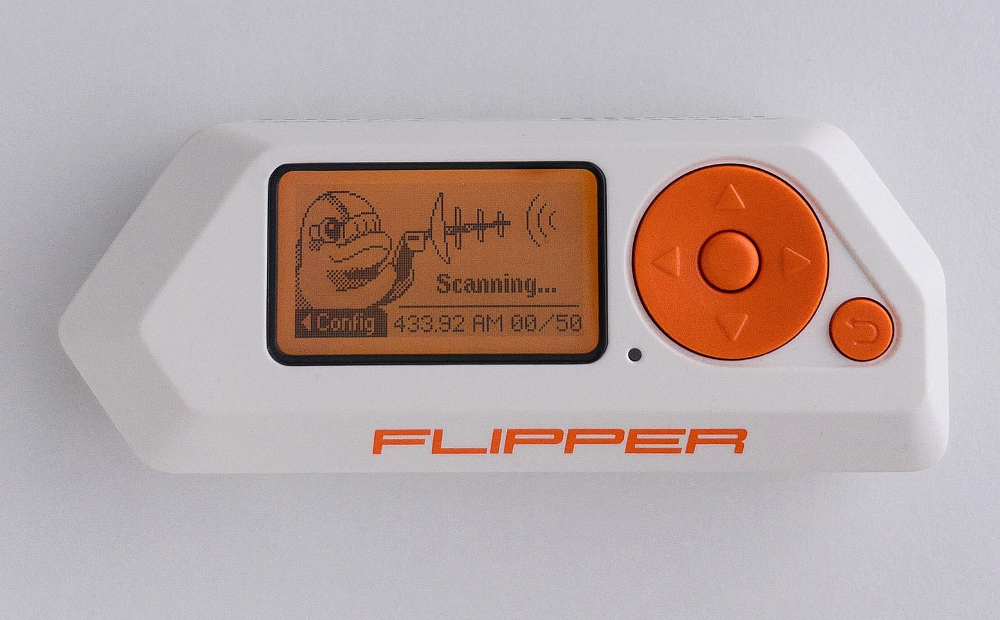

Do you have a Flipper Zero that you forgot the pin to?  It is actually quite easy to reset.

 | |
|---|---|
|1.  Remove the microSD card from the device.| |
|2.  Hold the UP and BACK buttons for 30 seconds. | |
|3.  When it asks you if you want to reset, push the right button to confirm that you want to reset it. | :)|

If that doesn't work, you will need to run qFlipper.  
 | |
|---|---|
|1. Download qFlipper from here: | https://docs.flipper.net/zero/qflipper |
|2. Connect your Flipper Zero to the computer via a USB cable| |
|3. Open advanced controls and click ERASE |  |
|4. Click Erase again to start the reset process.| |
|5. When the reset is done, click continue.|  |

