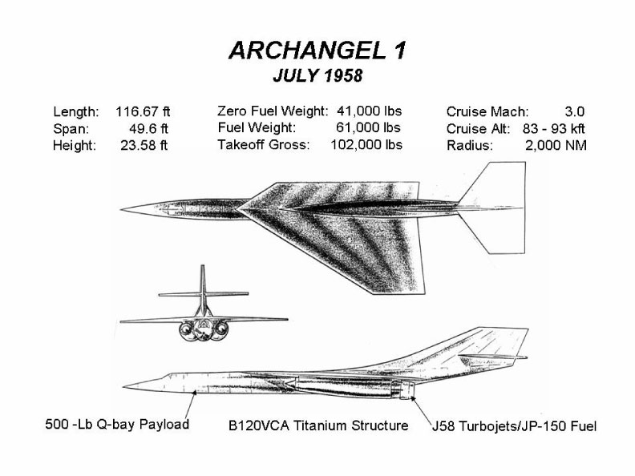
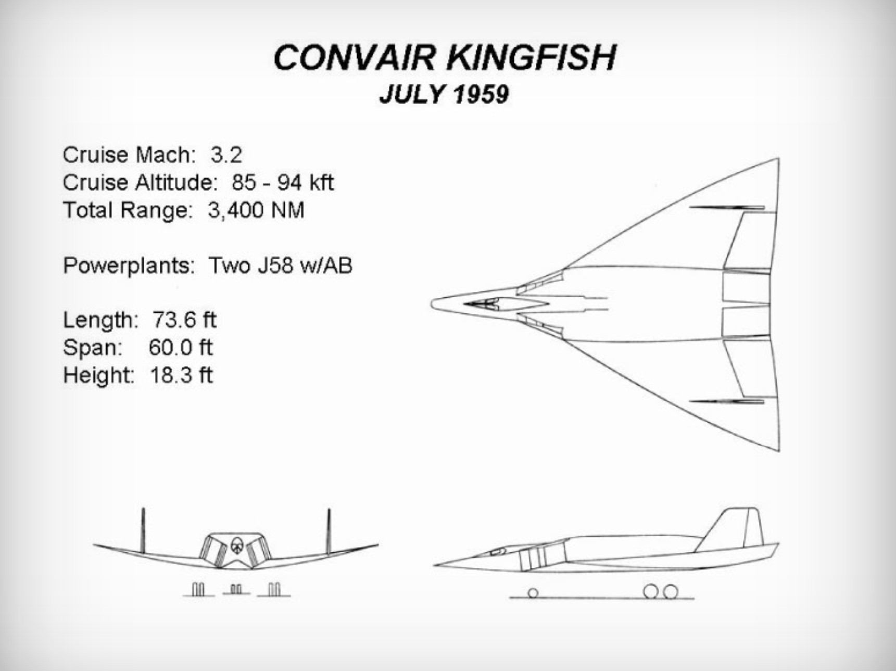

Kelly Johnson's drawings of the Archangel design alonside Convair's drawings of the Fish series.  

The A-2 design

Convair Fish design

A-7 - A-9 designs

A-10 Design

Corvair Kingfish design

According to *Ben Rich's Skunk Works*, Kelly Johnson was about to throw in the towel on the design competition with the A-12.  The CIA came back to him before he could quit and awarded him the contract.  That is how we ended up with the A-12 and the SR-71 in the end.
